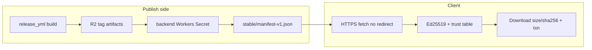
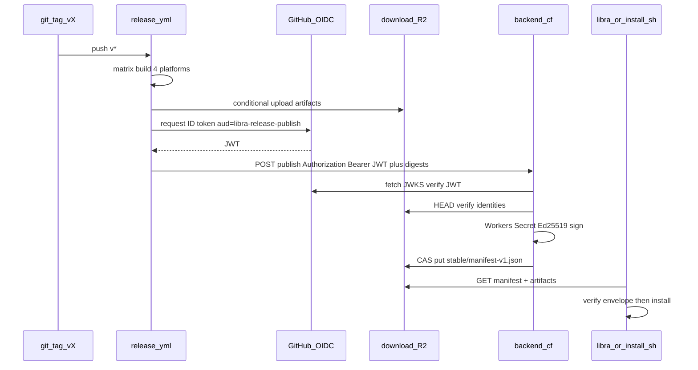
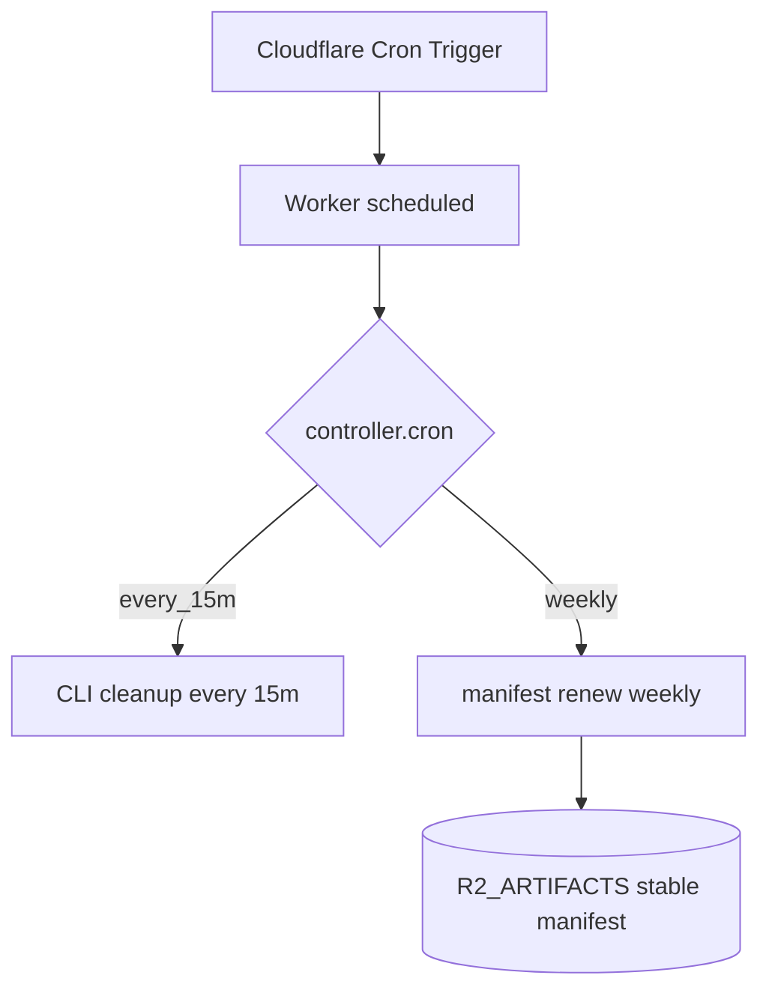
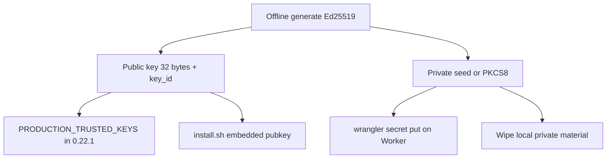
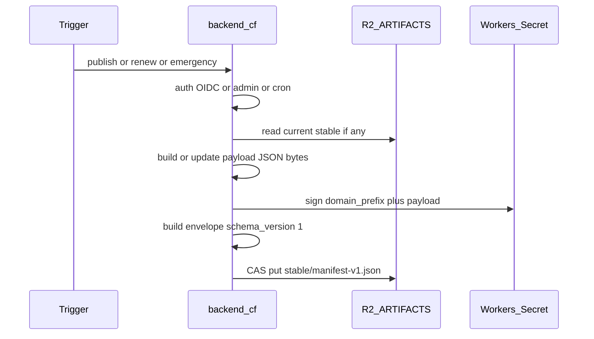

# UP-01 发布签名与自动升级链（设计讨论）

> Status: **design discussion**（架构讨论稿，非日期计划、非任务卡；可继续修订后再拆执行计划）
> Scope: 官方 Libra 二进制的 Ed25519 签名发布、`stable` manifest、以及客户端自动升级启用前置
> Long-track ID: [`plan-long.md`](../plan/plan-long.md) **UP-01**
> Client contract: [`docs/auto-upgrade.md`](../../auto-upgrade.md)、[`src/internal/upgrade/`](../../../src/internal/upgrade/)
> Publish CI: [`.github/workflows/release.yml`](../../../.github/workflows/release.yml)
> Backend: 兄弟仓库 `libra-backend` 分支 `cf`（Workers + D1 + R2）

变更记录：

1. 2026-08-21: 自讨论稿入库。冻结 D1（Action = `release.yml`）与 D2（私钥仅 Cloudflare Workers Secret）；写入 OIDC publish 流程与 Workers Cron renew 触发方式。
2. 2026-08-21: 冻结 **D3**——emergency（pause / revoke / 恢复）**必须**经 `libra-backend` Admin UI；禁止 GitHub `workflow_dispatch` 或其它旁路；Admin 界面为明确开发面。
3. 2026-08-21: 冻结 **D4**——Resume（`paused=false`）**不需要**双人审批；单 admin + 二次确认 + 审计即可。
4. 2026-08-21: 冻结 **D5**——download CDN 桶名为 **`artifacts`**；版本产物路径为 `libra/releases/v{tag}/…`；Backend binding 名为 **`R2_ARTIFACTS`**（与 Action rclone **同桶**）；与站点上传桶 `libra-backend`（`R2_BUCKET`）**分离**。`libra-backend` cf @ `baf869a` 已合入该 binding。
5. 2026-08-21: 冻结 **D6**——OIDC 钉死仓库为 **`libra-tools/libra`**（`repository_owner=libra-tools`，`repository=libra-tools/libra`）。
6. 2026-08-21: 冻结 **D7**——renew：Cron `0 6 * * 1`（UTC 周一 06:00）；若距 `expires_at` 仍 **> 60d** 则 Skip，否则续签。
7. 2026-08-21: 冻结 **D8**——Admin emergency 审计落 **D1**（不单独依赖 R2 append-only 作为唯一事实源）。
8. 2026-08-21: 冻结 **D9**——首个带非空 `PRODUCTION_TRUSTED_KEYS` 的客户端版本为 **`0.22.1`**。
9. 2026-08-21: 冻结 **D10**——第一份 production signed `stable/manifest-v1.json` 在 **实现本方案并上线** 时签发（与启用窗口绑定，不另择日历日）。
10. 2026-08-21: 补全 §7.2–7.3——密钥 ceremony 步骤与 publish/renew/emergency 共用 Ed25519 签名过程（domain prefix + envelope）。

---

## 1. 已冻结决策

| ID | 决策 | 含义 |
|---|---|---|
| **D1** | 「libra action」= [`.github/workflows/release.yml`](../../../.github/workflows/release.yml) | 不指 CLI / `automation` 或其他 Action 面；后续同类 workflow 若参与发布，须遵守同一「无私钥」边界 |
| **D2** | 私钥只在 Cloudflare Workers Secret | GitHub Action / repo secrets / Environment secrets **永不**存放或读取签名私钥；Backend 是唯一签名者 |
| **D3** | emergency **必须**走 Admin UI | pause / 写入 `revoked_versions` / 恢复发布（`paused=false`）一律经 `libra-backend` 已登录 **admin** 会话；**禁止** `workflow_dispatch`、公开 cron、或仅持 OIDC 的 Action 调用 emergency |
| **D4** | Resume **不需要**双人审批 | 恢复发布由单一 admin 完成：UI 二次确认 + 审计记录即可；不引入第二审批人 / 双钥匙流程 |
| **D5** | download 桶 = **`artifacts`** | Action rclone 与 Backend **`R2_ARTIFACTS`** **同一 R2 桶** `artifacts`；对象前缀 `libra/releases/v{tag}/` 存放该版本编译产物；与 Backend 现有上传桶 `libra-backend`（binding `R2_BUCKET`）**不得混用** |
| **D6** | OIDC 仓库 = **`libra-tools/libra`** | Backend 校验 GitHub OIDC 时钉死 `repository_owner == libra-tools` 且 `repository == libra-tools/libra`；其它 owner/repo（含 fork）一律 401/403 |
| **D7** | renew 周频 + Skip 阈值 | Workers Cron：`0 6 * * 1`（**UTC** 周一 06:00）；`expires_at - now > 60d` → Skip；否则读当前 stable → 验签 → 只改时间/`control_revision`/signatures → CAS 写回 |
| **D8** | emergency 审计存 **D1** | 每次 Admin pause / revoke / resume 写入 D1 审计行（谁、何时、旧/新控制字段、`control_revision`、payload digest）；Admin UI 只读列表读 D1；**不以** R2 对象为唯一审计事实源 |
| **D9** | 首个 trust 客户端 = **`0.22.1`** | `PRODUCTION_TRUSTED_KEYS` 首次非空合入并随 **`v0.22.1`** 发布；此前版本保持空表、自动升级构造性 inert |
| **D10** | 首份 stable 于 **方案实现上线时**签发 | 第一份 production signed `libra/releases/stable/manifest-v1.json` 在 Backend 签名链 + Action OIDC publish（及必要的 key ceremony）**实现并部署可用**后签发；指向当时已在 `artifacts` 的官方版本（预期含 `v0.22.1` 矩阵）；不另定独立日历日 |

架构因此定死：

**Action 只构建与上传不可变产物到 `artifacts`；Backend 是唯一签名与 `stable` manifest 发布者（写同一桶）；紧急控制只经 Admin 人机界面。**

---

## 2. 背景与现状

[`plan-long.md`](../plan/plan-long.md) 将 **UP-01** 列为下一执行任务：客户端自动升级已 code-complete，但因 `PRODUCTION_TRUSTED_KEYS` 为空而 **构造性 inert**；缺口是 release-key ceremony、发布侧签名、`install.sh` 验签。

完整规格曾整段迁移进 `plan-long`（commit `9438df97`，A.1–A.12），后被路线图改版冲掉，只剩一行摘要。讨论与实现仍应以该历史规格 + 当前代码契约为准。

| 层 | 事实 |
|---|---|
| 客户端 | [`src/internal/upgrade/manifest.rs`](../../../src/internal/upgrade/manifest.rs)：Ed25519 信封、`SIGNATURE_DOMAIN_PREFIX`、`MANIFEST_URL`、四平台 matrix、URL 绑定 |
| 发布 CI | [`release.yml`](../../../.github/workflows/release.yml)：tag `v*` → 四平台 build → rclone 上传 R2 → 上传 `install.sh`/`install.ps1`；**无签名、无 stable manifest** |
| 契约测试 | [`tests/upgrade_publish_contract_test.rs`](../../../tests/upgrade_publish_contract_test.rs) 钉死 envelope / matrix / renew 继承 `paused`/`revoked_versions` |
| 后台 | `libra-backend` **cf**：Workers + D1；`R2_BUCKET`→`libra-backend`（用户上传）；**已绑定** `R2_ARTIFACTS`→`artifacts`（commit `baf869a`）；尚无 release publish/renew/emergency 写入代码路径 |
| CDN / 发布 | Action 经 rclone 写桶 **`artifacts`**；公开域 `download.libra.tools`；路径见 **D5** |

客户端用户面说明见 [`docs/auto-upgrade.md`](../../auto-upgrade.md)。

---

## 3. 客户端契约（方案不得改动）

这些是客户端已经实现的 fail-closed 合同，发布方案只能**满足**，不能重定义。



- **端点**：`https://download.libra.tools/libra/releases/stable/manifest-v1.json`
- **签名消息**：`b"libra-upgrade-manifest-v1\0" || payload_bytes`
- **私钥隔离（A.6 + D2）**：私钥只进 Cloudflare Workers Secret；`release.yml` 的 build/upload 与 request-manifest job **永不接触私钥**
- **Per-tag（A.9）**：四平台 artifact 齐全且 identity 正确后才可签 stable；条件创建、禁止覆盖；普通发布必须逐字节继承当前 `paused`/`revoked_versions`
- **续签 / 紧急**：每周 renew；pause/revoke 走更高权限路径；一律递增 `control_revision`
- **首期矩阵**：`linux-amd64`、`linux-arm64`、`darwin-arm64`、`windows-amd64`（Windows 发布但 auto-upgrade 返回 `UnsupportedPlatform`）

历史 UP-01 A.1–A.12 全文锚点：`plan-long` 迁移提交 `9438df97`（当前 `plan-long` 正文仅保留摘要，属文档债）。

---

## 4. 职责切分（已冻结）

| 组件 | 职责 | 明确不做 |
|---|---|---|
| **`release.yml`** | 四平台 build；上传 `libra/releases/v{tag}/libra-{platform}[.exe]` + `.sha256`；汇总 digest 表；用 **GitHub OIDC** 调用后台 **publish** API；继续上传 `install.sh`/`install.ps1`（可与签名解耦） | **不读私钥**；不写 `stable/manifest-v1.json`；不引入任何签名用 GH secret |
| **libra-backend（cf）** | 校验 OIDC（`aud` / `repository` / `job_workflow_ref` 等）；核对四平台对象已存在且 hash/size 一致；组装 payload；用 Workers Secret 做 Ed25519 签名；CAS 写入 stable manifest；周 renew cron；admin/protected **pause/revoke**；审计日志 | 不编译 Rust；不把私钥下发给 Action |
| **CDN / download R2** | 桶 **`artifacts`**（D5）；binding **`R2_ARTIFACTS`**；服务 `download.libra.tools` | 与用户上传桶 `libra-backend`（`R2_BUCKET`）分离 |
| **客户端 / install.sh** | 验签、marker、anti-rollback（已有）；补预置公钥与 bootstrap 验签 | 不参与发布 |

### 4.1 R2 对象布局（D5，已冻结）

桶名：**`artifacts`**。Backend binding：**`R2_ARTIFACTS`**（Action `R2_BUCKET_NAME=artifacts` 同桶；`libra-backend` cf @ `baf869a` 已配置）。

| 键前缀 / 键 | 写入方 | 内容 |
|---|---|---|
| `libra/releases/v{tag}/libra-{platform}`（Windows 另有 `.exe` 等现有约定） | Action `build-and-upload` | 该版本编译产物 |
| `libra/releases/v{tag}/libra-{platform}.sha256` | Action（Unix 现有步骤） | 校验和 |
| `install.sh` / `install.ps1`（桶根） | Action `upload-install-scripts` | CDN 安装脚本 |
| `libra/releases/stable/manifest-v1.json` | **仅** Backend 经 `env.R2_ARTIFACTS`（publish / renew / Admin emergency） | 签名 envelope |

公开 URL 示例：`https://download.libra.tools/libra/releases/v0.20.0/libra-linux-amd64`。

**写入能力（代码核对，2026-08-21）：**

- 同账户 R2 Worker binding 默认具备 `put` / `get` / `head` / `delete` / `list`，**无需**再配 S3 access key。
- 当前仓库：仅完成 binding + `Env` 类型守卫；**尚无** `env.R2_ARTIFACTS.put(...)` 业务代码 → 配置上可写，产品路径尚未写入。
- `/api/upload` 仍只用 `R2_BUCKET`（`libra-backend`），**不得**改指 `R2_ARTIFACTS`。

### 4.2 调用流（新版本）



---

## 5. OIDC 请求发布（具体流程）

目标：`request-stable-manifest` job **证明自己是官方 `release.yml` 的一次 tag 发布**，从而获权让 Backend 签名；**不**向 Action 下发签名私钥，也**不**用长期 `x-registry-internal-token` 一类共享秘密做发布鉴权（现有 `/api/internal/verify` 是另一条 HS256 登记面，不复用）。

### 5.1 角色与信任根

| 角色 | 持有什么 | 不持有什么 |
|---|---|---|
| GitHub OIDC Provider | 为每个 job 签发短命 JWT（`iss=https://token.actions.githubusercontent.com`） | 签名私钥、R2 写权限 |
| `release.yml` `request-stable-manifest` | `id-token: write`；可向 GitHub 要自定义 `aud` 的 JWT；持有 artifact digest 表 | 签名私钥；Workers Secret；长期 Backend token |
| Backend Worker | GitHub JWKS 校验逻辑；Workers Secret（Ed25519）；`R2_ARTIFACTS` binding | GitHub PAT；构建产物源码 |

要点：Cloudflare 不必「把 OIDC 换成 CF API token」。Worker **本身就是 Relying Party**——验完 GitHub JWT 后，用本进程已有的 R2 binding + 签名 Secret 完成发布。

### 5.2 Action 侧步骤（`request-stable-manifest` job）

1. **触发前提**：`needs: build-and-upload` 全绿（四平台已上传到 `libra/releases/${{ github.ref_name }}/`）。
2. **权限**：该 job（仅该 job）声明：

   ```yaml
   permissions:
     id-token: write   # 向 GitHub 要 OIDC JWT
     contents: read    # 如需读仓库元数据；不要 contents: write
   ```

   其它 build/upload job **不需要** `id-token: write`。

3. **固定 audience**：向 GitHub 请求 ID token 时使用约定 `aud`，例如 `libra-release-publish`（**不是**默认的 repo owner URL）。示例：

   ```bash
   OIDC_JWT=$(curl -fsSL \
     "${ACTIONS_ID_TOKEN_REQUEST_URL}&audience=libra-release-publish" \
     -H "Authorization: Bearer ${ACTIONS_ID_TOKEN_REQUEST_TOKEN}" \
     | jq -r .value)
   ```

4. **组装 publish 请求体**（设计形态，字段可微调但语义固定）：
   - `version`：与 tag 一致的 release SemVer（无 `v` 前缀，对齐客户端 `ReleaseVersion`）
   - `tag`：`github.ref_name`（如 `v0.20.3`）
   - `artifacts[]`：四平台各 `{ platform, sha256, size }`（与 matrix 一致；URL 由 Backend 按契约拼出，不信任客户端自定义 host）
   - `run_id` / `workflow_sha`：审计用

5. **调用 Backend**：

   ```http
   POST https://libra.tools/api/internal/release/publish
   Authorization: Bearer <OIDC_JWT>
   Content-Type: application/json
   ```

   （具体 host 以生产 `APP_BASE_URL` 为准；路径前缀 `/api/internal/release/` 与现有 registry verify 隔离。）

6. **失败语义**：非 2xx → job 失败 → 整次 release 红。Artifact 可能已在 R2，但 **无 signed stable manifest** → 客户端 fail-closed 不升级（符合 UP-01）。

7. **禁止**：在该 job 或任何 job 配置签名私钥；本 job 唯一外呼是 Backend publish（及可选的只读 HEAD 自检）。

### 5.3 Backend 侧校验顺序（fail-closed，全部通过才签名）

对 `Authorization: Bearer` 中的 JWT，按固定顺序：

1. **结构**：JWT 三段；`alg` 必须为 GitHub 使用的非对称算法（当前为 RS256）；拒绝 `none` / 对称 alg。
2. **JWKS**：从 `https://token.actions.githubusercontent.com/.well-known/jwks` 取钥（缓存 + 合理 TTL）；用 `kid` 选钥验签。
3. **时间**：校验 `exp` / `nbf` / `iat`（允许小时钟偏差，如 ±60s）；过期即 401。
4. **Issuer**：`iss == https://token.actions.githubusercontent.com`。
5. **Audience**：`aud` 含约定值 `libra-release-publish`（若 `aud` 为数组则成员匹配）。错误 `aud` → 401。
6. **仓库钉死（D6）**：`repository == libra-tools/libra` 且 `repository_owner == libra-tools`；其它仓库（含 fork）→ 401/403。
7. **工作流钉死**：`job_workflow_ref`（或 `workflow_ref`）必须匹配 **仅** `.github/workflows/release.yml` 在允许 ref 上的形态，例如：
   - 允许：`libra-tools/libra/.github/workflows/release.yml@refs/tags/v*`
   - 拒绝：其它 workflow、fork 的 `pull_request`、任意 `refs/heads/*`（首期只接受 **tag push** 触发的 release 运行）
8. **事件钉死（推荐）**：`event_name == push` 且 ref 为 tag；或校验 `ref`/`sha` 与 body 中 `tag` 一致。
9. **Subject（`sub`）**：记录审计；策略上以 `job_workflow_ref` + `repository` 为主约束，`sub` 作为辅助。

OIDC 通过后进入 **业务校验**（与 A.9 对齐，仍在签名之前）：

10. Body 四平台齐全、platform 唯一、`version`/`tag` 交叉一致。
11. 对每个 artifact：`R2_ARTIFACTS` `HEAD`（或等价）确认对象存在；`sha256`/`size` 与请求一致（Backend 以存储侧为准，不一致 → 409/422，不签名）。
12. 读当前 `stable/manifest-v1.json`（若存在）：先验签；`new < current` → fail；`new > current` 时从当前 payload **逐字节继承** `paused`/`revoked_versions`；递增 `control_revision`；设 `expires_at = published_at + 90d`。
13. 用 Workers Secret 对 `b"libra-upgrade-manifest-v1\0" || payload_bytes` 做 Ed25519 签名，写 envelope。
14. CAS 写入 `libra/releases/stable/manifest-v1.json`（ETag / If-Match 或 R2 条件写）；冲突则重试有界次数或失败。
15. 响应 200 + `{ control_revision, version, payload_digest, signer_key_id }`；Action 只记日志/artifact，**不**拿到私钥材料。

### 5.4 与现有 `internal/verify` 的边界

| | `/api/internal/verify`（现状） | `/api/internal/release/publish`（本方案） |
|---|---|---|
| 调用方 | registry / 设备流相关 | 仅 `release.yml` |
| 凭证 | `x-registry-internal-token` + 用户 HS256 JWT | **仅** GitHub OIDC JWT |
| 结果 | 返回 push/pull 权限 | 侧写签好的 stable manifest |
| 密钥 | registry secrets | Workers Ed25519 签名 Secret |

二者不得混用同一 gate secret，避免 registry 泄露波及发布签名。

---

## 6. 三操作语义：publish / renew / emergency

| 操作 | 何时 | 可变字段 | 不可变字段 |
|---|---|---|---|
| **publish** | 新 tag / 更高 `version` | `version`、`artifacts`、时间、`signatures`、`control_revision` | 须从当前 payload **逐字节继承** `paused` / `revoked_versions` |
| **renew** | 同一 `version` 仍为 stable，但需延长有效期 | 仅 `control_revision`、`published_at`、`expires_at`、`signatures` | `version` / `artifacts` / `channel` / `min_key_generation` / `paused` / `revoked_versions` |
| **emergency** | 暂停发布或撤回版本 | `paused` 和/或 `revoked_versions`，以及时间 / `control_revision` / `signatures` | `version` / `artifacts`（除非另有明确更高权限仪式） |

**Renew 的目的**：signed manifest 有 `expires_at`（普通发布为 `published_at + 90d`）。若线上最新版本长期无新 tag，不续签则 envelope 过期，客户端拒用。Renew **不是**发新版本。

### 6.1 Renew 在 Cloudflare 上如何触发

与 `libra-backend` cf 分支现状对齐：用 **Workers Cron Triggers**，不是公开 HTTP。

| 项 | 设计 |
|---|---|
| 机制 | [Workers Cron Triggers](https://developers.cloudflare.com/workers/configuration/cron-triggers/)：平台按 cron 表达式直接调用 Worker 的 `scheduled(controller, env, ctx)` |
| 配置落点 | `libra-backend` `apps/tanstack-app/wrangler.jsonc` 的 `triggers.crons`（现状已有 `*/15 * * * *` 做 CLI 清理） |
| 表达式（**D7**） | `"0 6 * * 1"`（**UTC** 周一 06:00）；与 `*/15` **并存**，在 `scheduled` 里用 `controller.cron` 分流 |
| Handler | 扩展 `src/server.ts` 的 `scheduled`：`cron === '0 6 * * 1'` → `runManifestRenew(env)`；`*/15` → 既有 CLI cleanup |
| 鉴权 | 平台调用，无 HTTP secret；handler 内直接使用 Workers Secret + `R2_ARTIFACTS`。**禁止**做成无鉴权的 `GET /api/cron/renew` |
| 幂等（**D7**） | 若 `expires_at - now > 60 days` → Skip（不写、不抬 `control_revision`）；否则读当前 stable → 验签 → 只改时间/`control_revision`/signatures → CAS 写回 |
| 失败 | `controller.noRetry()`（与 CLI cleanup 同口径）；告警走 Workers 日志/observability |
| 本地验证 | `wrangler dev --test-scheduled` + `/__scheduled`，或 `/cdn-cgi/handler/scheduled` |



**明确不采用：**

- GitHub Actions 定时 `schedule:` 调 Backend renew（多一条 OIDC 面且无新 artifact）
- 公开 HTTP cron + 共享 secret（旧 Next 站模式；cf 已改成平台 Cron）

### 6.2 Emergency 必须经 Admin（D3，已冻结）

Emergency 覆盖的操作面（与 §6 表一致）：

| Admin 动作 | Manifest 效果 |
|---|---|
| 暂停升级 | `paused=true`，递增 `control_revision`，重签 |
| 撤回版本 | 追加/设置 `revoked_versions`，递增 `control_revision`，重签 |
| 恢复发布 | `paused=false`（单 admin + UI 二次确认 + 审计，**无**双人审批，见 D4），递增 `control_revision`，重签 |

**鉴权与通道（强制）：**

- 唯一入口：`libra-backend` **Admin UI**（已登录且 `role=admin` 的会话）→ 调用受保护的 admin/release emergency API → Worker 用 Workers Secret 签名并 CAS 写回 stable manifest。
- **禁止**：GitHub Actions `workflow_dispatch` / 任意 OIDC job 调用 emergency；公开 HTTP cron；长期 shared secret 旁路。
- 每次 emergency 必须写 **D1 审计记录**（D8：谁、何时、旧/新 `paused` 与 `revoked_versions`、`control_revision`、payload digest）。
- Admin UI 只读审计列表从 **D1** 查询（至少最近 N 次）。

**Admin UI 开发范围（`libra-backend` cf，明确交付面，非「可选」）：**

- 展示当前 stable manifest 摘要（version、`paused`、`revoked_versions`、`expires_at`、`control_revision`、signer）。
- 表单：Pause / Resume；向 `revoked_versions` 添加 SemVer（校验格式、禁止空操作）。
- 二次确认（Pause、Resume、撤回均须确认；**Resume 不要求双人审批**，D4）。
- 调用后端 emergency API；失败 fail-closed 并展示可读错误。
- 只读审计列表（读 **D1**，D8；至少能核对最近 N 次 emergency）。

实现落点预期在现有 admin 路由族下（如 `apps/tanstack-app/src/routes/.../admin/` + `/api/admin/...`），与仅供 `release.yml` 使用的 `/api/internal/release/publish` **分离**：publish 仍只认 OIDC；emergency **只认 admin session**。

---

## 7. 密钥与信任根

1. **Ceremony（一次性）**：离线生成 Ed25519；公钥进 `PRODUCTION_TRUSTED_KEYS` + `install.sh` 预置；**私钥只进 Cloudflare Workers Secret**（D2）；不进 GitHub repo / Environment secrets。细节见 §7.2。
2. **Rotation**：新 key `generation+1`；overlap 靠旧客户端较低 `MIN_TRUSTED_KEY_GENERATION`；新客户端抬高 floor。私钥轮换只改 Workers Secret + 客户端 trust table，不改 Action 密钥配置（Action 本无密钥）。
3. **启用阈值（D9 + D10）**：客户端 **`0.22.1`** 首次携带非空 `PRODUCTION_TRUSTED_KEYS`；此前保持 inert。第一份 production signed stable 在 **实现本方案并上线时**签发（D10）。

### 7.1 首发启用顺序（已冻结）

| 步骤 | 状态 |
|---|---|
| 客户端 **`0.22.1`** 首次携带非空 `PRODUCTION_TRUSTED_KEYS`（及 `install.sh` 预置公钥） | **已冻结（D9）** |
| 第一份 production signed `stable/manifest-v1.json` | **已冻结（D10）**：在方案实现上线时签发；前置：`artifacts` 上已有可核对的官方版本产物（含 `v0.22.1`）、Workers Secret 与 `R2_ARTIFACTS` 可用、OIDC publish 路径可用 |
| 首签失败 | 保持无 stable / 客户端仍可依赖 inert 或仅本地安装；**不得**发布未签名或错误签名的 envelope；修复后重试签发 |

### 7.2 密钥 ceremony（一次性）

目标：建立官方 Ed25519 信任根，使客户端与 `install.sh` 能验签，私钥永不离开 Cloudflare Workers。



**推荐步骤（实施时照此执行；Secret 名可微调但语义固定）：**

1. **离线生成**（不在 CI、不在共享开发机上长期驻留）：
   - 生成 Ed25519 密钥对（例：`openssl genpkey -algorithm Ed25519` 或等价工具）。
   - 选定稳定 `key_id`（例：`libra-release-1`）。
   - 记录公钥 32 字节（raw）、`not_before` / `not_after`、`generation=1`。
2. **公钥入库（公开）**：
   - 在 `src/internal/upgrade/trusted_keys.rs` 填入 `PRODUCTION_TRUSTED_KEYS` 一项（随 **`0.22.1`**，D9）。
   - `install.sh` 预置同一公钥（及 `key_id`），供 bootstrap 独立验签。
3. **私钥进 Workers（机密，D2）**：
   - 仅操作员在受控环境执行，例如：
     `cd apps/tanstack-app && pnpm exec wrangler secret put LIBRA_RELEASE_ED25519_SEED`
   - 存入形式由实现选定并钉死一种：raw 32-byte seed（hex/base64）或 PKCS8；**不得**写入 GitHub secrets / `.dev.vars` 提交 / 聊天记录。
   - Backend 启动或首次签名时 `importKey` 为 WebCrypto / 等价 Ed25519 签名钥；失败则 **fail-closed**（拒绝 publish/renew/emergency）。
4. **本地私钥销毁**：ceremony 结束后从操作员机器删除私钥材料；如需 disaster recovery，仅存 **offline 冷备份**（不在线、不进 CI），轮换时再启用。
5. **校验**：用测试 payload 在 Worker 侧签名 → 用客户端 `verify_envelope_bytes` + 已填公钥验通；再按 D10 发首份 production stable。

**禁止：** 在 `release.yml` 任何 job 配置该 Secret；把私钥打进镜像、日志或 D1。

### 7.3 日常签名过程（publish / renew / emergency）

三者共用同一密码学步骤；差别只在 **谁触发** 与 **payload 哪些字段可变**（见 §6）。



**密码学（与客户端契约一致，不得改）：**

1. 序列化 **payload** JSON（UTF-8 字节，字段语义见客户端 `VerifiedManifest`）。
2. 构造待签消息：
   ```text
   message = b"libra-upgrade-manifest-v1\0" || payload_bytes
   ```
   （`SIGNATURE_DOMAIN_PREFIX`，见 `src/internal/upgrade/manifest.rs`。）
3. 用 Workers Secret 中的 Ed25519 私钥对 `message` 签名，得 64 字节签名。
4. 组装 **envelope**：
   ```json
   {
     "schema_version": 1,
     "payload": "<base64(payload_bytes)>",
     "signatures": [
       { "key_id": "libra-release-1", "signature": "<base64(sig)>" }
     ]
   }
   ```
5. 写入 `artifacts` 键：`libra/releases/stable/manifest-v1.json`（CAS / 条件写）。
6. 客户端 / `install.sh`：取 envelope → 用 trust table 验签 → 再解析 payload → 再按 URL/sha256/size 下二进制。

**按触发器：**

| 操作 | 触发 | 签名前多做什么 |
|---|---|---|
| **publish** | `release.yml` OIDC → `/api/internal/release/publish` | HEAD 核对 `libra/releases/v{tag}/…` 四平台；`version` 上升；继承 `paused`/`revoked_versions` |
| **renew** | Cron `0 6 * * 1` UTC（D7） | 若 `expires_at - now > 60d` Skip；否则只改时间与 `control_revision` |
| **emergency** | Admin UI → `/api/admin/release/...` | 改 `paused` / `revoked_versions`；写 **D1** 审计（D8） |

**Action 不参与签名：** 只上传产物并提交 digest；签名字节只在 Worker 内用 Secret 生成。

---

## 8. Backend / Action 能力面（设计级，非任务卡）

### 8.1 Backend

- 独立 R2 绑定 **`R2_ARTIFACTS`** → 桶名 **`artifacts`**（D5；cf @ `baf869a` 已合入）；勿与 `R2_BUCKET`→`libra-backend` 混用。
- Internal API `/api/internal/release/publish`：鉴权按 §5（仅 OIDC）；与 `/api/internal/verify` 隔离；**不**暴露 emergency。
- Cron：每周 renew（无 OIDC、无 HTTP）。
- **Admin UI + `/api/admin/release/...`（D3，必做）**：pause / revoke / resume + **D1 审计**（D8）；仅 admin session；签名仍用同一 Workers Secret，Action 永不接触。

### 8.2 `release.yml` 最小改动形状

在现有 `build-and-upload` **之后**增加 **无私钥** 的 `request-stable-manifest` job（细节见 §5）：

1. `needs: build-and-upload`（install-scripts 可并行或其后）
2. `permissions.id-token: write`（仅本 job）+ 自定义 `aud=libra-release-publish`
3. 收集四处 sha256/size → `POST .../publish` + `Authorization: Bearer <OIDC_JWT>`
4. 非 2xx 则整次 release 红（未签则客户端不升级）
5. **禁止**任何 `LIBRA_RELEASE_SIGNING_KEY` 类 GH secret

---

## 9. 明确不采纳的备选

| 方案 | 状态 |
|---|---|
| 仅 GH protected env 签名 | **不采纳**（与 D2、经后台服务目标冲突） |
| Backend 编排、GH 持钥 | **不采纳**（与 D2 冲突；且易触犯 A.6 secret 可见约束） |
| Action 编译 + Backend 签名（本方案） | **已冻结** |

---

## 10. 文档债与后续

- `plan-long` 应恢复或外链 UP-01 A.1–A.12 全文（现只有摘要）。
- 日期计划（未来）再拆：ceremony → Backend API/R2/OIDC → `release.yml` job → `install.sh` 验签 → 启用验收；**本文仍不定执行卡**。
- 可收成 **ADR-UP01-01**（职责切分 + D1/D2 + 契约引用）后再开日期计划。

### 10.1 仍待讨论的点

1. （运维可选）部署后对 `R2_ARTIFACTS` 做一次只读 `head` / 受控试写 smoke，确认生产 Worker 已拿到最新 binding。
2. （建议补冻）`revoked_versions` 是否只允许追加、禁止删除。
3. `install.sh` 验签选型（openssl / 其它）；Workers Secret 存 raw seed 还是 PKCS8（§7.2 允许实施时钉死一种）。
4. ceremony 用的正式 `key_id` 字符串（建议稿 `libra-release-1`）与 `not_before`/`not_after` 窗口。
