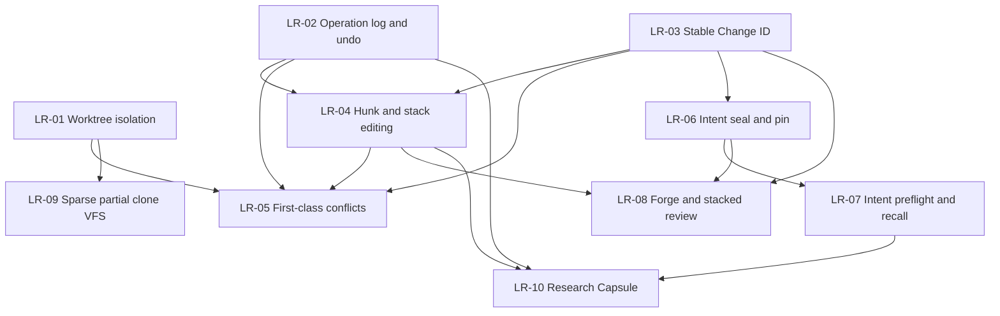

# Libra 长期功能规划

## 文档职责与维护协议

本文是 Libra 不绑定具体发布日期和版本号的长期能力组合路线图。它回答“哪些能力值得长期投资、为什么、依赖什么、何时具备进入日期计划的条件”，不是 release 承诺、owner 清单或逐项实施任务表。具体设计、迁移、拆分、发布和回滚只进入按日期计划或后续 RFC/ADR。

本文从真实开发者工作流出发，持续审计以下版本管理与相邻项目：

- Sapling：Smartlog、提交栈编辑、mutation lineage、undo/redo、EdenFS。
- Jujutsu：operation log、稳定 Change ID、一等冲突、自动 descendant rebase、并发 operation DAG。
- GitButler：并行 branch workspace、hunk assignment、图形化历史编辑、operation snapshots、Forge 集成。
- Grit：Rust Git 引擎、上游 Git 测试套件驱动的兼容性治理。
- Lore：大型二进制、dirty-set、sparse/virtual clone、shared store、dependency hydration、FastCDC。
- Entire：外部 Agent session/checkpoint、commit linkage、rewind/resume、多 Agent review。
- Mainline：sealed intent、commit pin、preflight、intent-first review、coverage/gaps。
- research-git：Feature Capsule、实验谱系、recall/compose、compare/ablation/provenance。
- git-sync：ref/object 复制、plan/policy、pack relay、仓库格式迁移。
- Grok Build：可移植 Agent 定义、ACP/headless/PTY、hooks，以及 hermetic/fault-injection 测试基础设施。

`agenta-ai/agenta` 的版本能力面向 prompt、workflow、evaluator、testset 和 environment 等领域对象，Grok Build 的主要事实模型则是 coding Agent runtime 与交互/测试基础设施；`MachineWisdomAI/fava-trails` 与 `ruvnet/agentic-flow`（含 agentic-jujutsu）是构建在 Jujutsu 语义之上的 Agent 共享记忆/编排层，消费 VCS 原语而非实现 VCS。四者都不是源码版本控制系统，因此只作为相邻领域参考，不作为 Libra VCS 功能对标基线。

状态定义如下：

| 状态 | 含义 |
|---|---|
| 候选 | 有问题线索，但 Libra 缺口、架构适配或证据尚不足 |
| 已验证 | 已同时核对竞品证据与 Libra 当前源码/测试，确认问题和可执行缺口真实存在 |
| 已排期 | 已有按日期计划覆盖该 LR 的明确范围，并从本文链接 |
| 实施中 | 日期计划已有已合入和未完成切片，长期完成判据仍未全部满足 |
| 已实现 | 当前可发布版本中的代码、测试、用户/兼容文档共同证明完成判据已满足 |
| 已替代 | 原问题仍有效，但由另一 LR 或更合适的机制承接 |
| 不采纳 | 经审计确认不适合 Libra，保留编号与理由 |

只有当前 checkout 的代码、测试、兼容性与用户文档，以及可发布版本证据共同成立时，LR 才能标记“已实现”。日期计划写完、竞品已有、存在 schema 或文档声明都不构成实现证明。LR 编号一经引用不重编号；详细章节不承担排序，唯一排序入口是“长期功能总览”。

## 本次竞品审计快照

审计时间：**2026-07-29**。发现范围严格限定为 `/Volumes/Data/competition/*/*`；未扫描内部嵌套仓库、vendor 或 submodule。本轮发现 16 个直接仓库（首次纳入 `MachineWisdomAI/fava-trails` 与 `ruvnet/agentic-flow`），全部在更新前证明工作区干净且存在 tracking/upstream，并使用各自原生 VCS 的 `pull --ff-only` 更新；表中 revision 是更新后实际审计 checkout。`blocked-*` 只表示本地 revision 可读，**不**表示已更新到远端最新版本。

| 竞品 | 类型 | 分支 | 审计 revision | 更新结果 | 最后审计 | 证据入口 |
|---|---|---|---|---|---|---|
| `agenta-ai/agenta` | Libra | `main` | `a3e7fdf1c33c` | fast-forward：`cb095f7` → `a3e7fdf` | 2026-07-29 | `api/oss/src/core/sessions/{turns,records}/`、`docs/design/sessions-last-message-only/`、runner reconstruct/cancel 源码与测试 |
| `cursor/agent-trace` | Git | `main` | `2754f077f3e5` | 已是最新 | 2026-07-29 | `README.md`、`schemas.ts`、`reference/` |
| `entireio/cli-checkpoints` | Libra | `entire/checkpoints/v1` | `620170f3b452` | 已是最新 | 2026-07-29 | checkpoint object tree |
| `entireio/cli` | Libra | `main` | `84942175831d` | fast-forward：`ec5d9a7` → `8494217` | 2026-07-29 | `CHANGELOG.md`、`cmd/entire/cli/gitrepo/reftable.go`、`cmd/entire/cli/strategy/manual_commit_session.go`、测试 |
| `entireio/git-sync` | Libra | `main` | `298c7f1f1be3` | 已是最新 | 2026-07-29 | `README.md`、`docs/`、`client.go`、`internal/` |
| `epicgames/lore` | Git | `main` | `1453a0dd9f47` | fast-forward：`9664606` → `1453a0d` | 2026-07-29 | `lore-revision/src/store/composite.rs`、`lore-storage/src/local/mutable_store.rs`、`lore-server/src/grpc/forwarded_*`、`lore-credential/src/jwt.rs` |
| `facebook/sapling` | Git | `main` | `f74e59bab799` | fast-forward：`2d413f4` → `f74e59b` | 2026-07-29 | `eden/mononoke/scs/if/source_control.thrift`（run_as）、`eden/fs/cli_rs/edenfs-saved-state/`、`eden/scm/sapling/ext/fbcodereview.py` |
| `GitButler/gitbutler` | Git | `master` | `315653459e75` | fast-forward：`5a3a59c` → `3156534` | 2026-07-29 | `crates/but-api/src/worktrees.rs`、`crates/but-core/src/commit/mod.rs`、`crates/but/src/utils/{merged_upstream,rejection}.rs`、`crates/but/skill/SKILL.md` |
| `GitButler/grit` | Git | `main` | `dfb079967b9c` | 已是最新 | 2026-07-29 | `TESTING.md`、`data/tests/`、`scripts/run-tests.sh`、`docs/progress/` |
| `graphwisdom/perstate` | Git | `master` | `95e27e3bb103` | 已是最新 | 2026-07-29 | `README.md`、`scripts/perstate-{prepare,commit,prune}.sh` |
| `jj-vcs/jj` | Git | `main` | `6bacc36d3c72` | fast-forward：`732bbc0` → `6bacc36` | 2026-07-29 | `cli/src/complete.rs`、`cli/src/git_util.rs`、`CHANGELOG.md` |
| `MachineWisdomAI/fava-trails` | Git | `main` | `5a8cdfd96d5e` | 首次纳入（已是最新） | 2026-07-29 | `README.md`、`src/fava_trails/vcs/jj_backend.py`、`src/fava_trails/{trust_gate,trail}.py` |
| `mainline/mainline` | Git | `main` | `eb981310cbae` | fast-forward：`37bdcb7` → `eb98131` | 2026-07-29 | `CHANGELOG.md` v0.5.1、`internal/engine/pr_fork.go`、`internal/hooks/dispatcher.go`、`.github/workflows/mainline-pr-intent.yml` |
| `ruvnet/agentic-flow` | Git | `main` | `d069fff77063` | 首次纳入（已是最新） | 2026-07-29 | `packages/agentic-jujutsu/`（`README.md`、`src/{operations,agent_coordination}.rs`）、`agentic-flow/src/harness/provenance.ts`、`docs/adr/` |
| `StepzeroLab/research-git` | Libra | `main` | `3209501f82d5` | fast-forward：`bea0427` → `3209501`（docs-only） | 2026-07-29 | `README.md`、`src/rgit/{recall,compare}.py`、`src/rgit/mcp_server.py` |
| `xai-org/grok-build` | Git | `main` | `02d9359435d0` | fast-forward：`6e38642` → `02d9359` | 2026-07-29 | `crates/codegen/xai-grok-shell/src/leader/mod.rs`、`xai-grok-tools/tests/test_subagent_soak.rs`、`xai-grok-config/src/signed_policy.rs`、`xai-grok-workspace/src/export_github.rs` |

最近审计记录最多保留 12 次；超过上限后把更早记录压缩为 revision 集合与优先级结论，不保留逐仓 pull 日志。

| 审计日期 | 仓库数 | 更新摘要 | 路线图结论 |
|---|---:|---|---|
| 2026-07-29 | 16 | 9 个 fast-forward、7 个已是最新（含首次纳入的 fava-trails、agentic-flow）；全部仓库更新前后均保持干净，无 blocked/失败 | 无优先级变化；GitButler worktree-aware operations 与 change-ID-in-transaction、Mainline fork-PR intent 与 hook context 预算强化 LR-01/LR-03/LR-06/LR-08 证据；reftable 互操作记入兼容增强清单；Libra 推进至 v0.19.81 |
| 2026-07-25 | 14 | 6 个 fast-forward、8 个已是最新；全部仓库更新前后均保持干净，无 blocked/失败 | 无优先级变化；Libra 自 v0.19.52 推进至 v0.19.63，W2 全部入库（rerere/stash/merge-file/gc）、registry v2、legacy 迁移、Agent workspace lease 已交付；LR-01 剩余崩溃矩阵与 parallel lanes |
| 2026-07-23 | 14 | 7 个 fast-forward、7 个已是最新；全部仓库更新前后均保持干净，无 blocked/失败 | 无优先级变化；LR-01 因 Libra Part C W1 多个已合入切片改为“实施中”，日期计划索引按当前完成事实纠偏 |
| 2026-07-20 | 14 | 8 个 fast-forward，4 个已是最新，`agenta` pull timeout、`cli-checkpoints` status timeout 后安全跳过；首次纳入 Perstate | 无优先级变化；LR-01 的 sequencer 隔离缺口按当前源码收窄 |
| 2026-07-17 | 13 | GitButler、Sapling、Jujutsu 快进；其余已是最新；首次纳入 Grok Build | 无优先级变化 |
| 2026-07-16 | 12 | 10 个快进/已最新，2 个 `blocked-dirty` | 无优先级变化 |

**本次结论：竞品审计本身不产生优先级变化；执行序列的变化来自用户决定。** 2026-07-29 按用户决定新增 **CT-01**（上游 Git 套件驱动的兼容性证据账本 / Grit Git 兼容测试迁移）并置于执行序列首位，UP-01 顺延；LR-01..LR-10 与 SB-01..SB-04 的优先级、状态和判据均不变。详见「长期功能总览」CT-01 行、CT-01 专节与「实施顺序」。

竞品方面：

- **GitButler `315653459e75`**（152 提交）：本轮最实质的变化。linked worktree 成为一等操作面——operations 与 rebase Editor 具备 worktree 感知，新增 feature-gated `crates/but-api/src/worktrees.rs`（list/archive/commit-from）；每个 mutation transaction 返回 `(sha, change_id)` 并在 CLI 输出打印（`crates/but-core/src/commit/mod.rs:868` 的 `CommitIdentifiers`），conflict 报告以 change ID 为键（`crates/but/src/command/legacy/conflict_notice.rs`）；新增 `MergedUpstream` 拒绝改写已上游合入历史（`crates/but/src/utils/merged_upstream.rs`）和 hunk 拒绝的事务回滚后依赖归因解释（`crates/but/src/utils/rejection.rs`）；agent 输出收紧为 human 输出子集并重写 SKILL.md 契约。分别强化 LR-01、LR-03、LR-04 与 LR-06 的既有判断。
- **Mainline `eb981310cbae`（v0.5.1）**：新增 fork-PR intent comment（`internal/engine/pr_fork.go`）——以显式 refspec 拉取不受信 fork 的 actor log 到一次性 import ref、校验 head SHA 后重建 intent、upstream-wins 按 IntentID 去重、用完即删；`pull_request_target` workflow 双重 staleness 校验加 `persist-credentials: false`。另有 hook context 注入硬预算（session-start 32 KiB / turn-start 16 KiB / 字段 2 KiB，`internal/hooks/dispatcher.go:89-92`）与语义压缩。分别强化 LR-06/LR-08 的不可信来源发布证据与 LR-07/SB-02 的注入边界证据。
- **Entire CLI `84942175831d`**：主要新增 reftable 后端支持——go-git 无法读 reftable refs，遂以 `reftableStorer` shell out 到 git CLI 并统一所有 repo open 入口（`cmd/entire/cli/gitrepo/reftable.go`）；另有跨 worktree session 归属歧义 warning（`strategy/manual_commit_session.go:239-260`）。reftable 是 Git 互操作兼容项，记入兼容增强清单；session 归属歧义强化 LR-01 的 attribution 缺口证据。
- **Lore `1453a0dd9f47`**：edge 部署 RPC forwarding、CompositeStore `durable_delay` 读副本优先（`lore-revision/src/store/composite.rs:287`）、torn-write bucket 自愈（`lore-storage/src/local/mutable_store.rs:263`）、commit 预分配内存许可与目录扇出上限、JWT audience 标签边界修复（`lore-credential/src/jwt.rs:103-107`）。为 LR-09/tiered storage 与资源边界提供工程证据，无新 LR。
- **Sapling `f74e59bab799`**：几乎全部是 Mononoke 服务端工作；值得记录的是 `run_as` hook dry-run（以其他身份预演 landing hooks，`source_control.thrift:1675-1697`，LR-06 发布 preflight 证据）、EdenFS saved-state 按 project_metadata 过滤（LR-09 hydration snapshot 证据）、smartlog 对 Phabricator 瞬时错误的降级（LR-08 Forge 装饰必须 best-effort 的证据）。
- **Jujutsu `6bacc36d3c72`**：4 天 10 个 CLI 层提交（重复参数 last-wins、remote tags tracked、多 workspace `<name>@` 补全、colocation 错误修复），无 core 变化，不改变 LR-02/LR-05 判断。
- **research-git `3209501f82d5`**：纯文档（README 重写，7 个提交零代码）。首次公开完整表述 recall-as-regeneration、byte-exact run freeze、`variant_of` 谱系与只读 MCP 共享记忆面；强化 LR-10/LR-07 的方向证据，无新代码能力。
- **Grok Build `02d9359435d0`**：sandbox profile 拒绝逃逸到共享 leader 进程（fail-closed，`xai-grok-shell/src/leader/mod.rs:790`）、workspace 文件引用绕过 confinement 与 `acceptEdits` 信任扩大修复、subagent 生命周期 soak 测试（线程/fd/RSS 稳态断言）、managed-config 签名验证与远端 kill-switch、hook provenance。继续强化 SB-02/SB-04 证据，不构成新 VCS LR。
- **Agenta `a3e7fdf1c33c`（v0.106.0）**：session_states 改为 append-only `session_turns` ledger 加带 drop tracking 的 durable record log、服务端 history reconstruction、cancel/steer 控制面。仍是 Agent 平台而非 VCS；其“resume 是对 ledger 的查询而非可变行”与“record 缺失即 fail loud”是 AgentRuntime session 持久化的可参考模式。
- **Grit `dfb079967b9c`**（本轮首次给出结论条目，此前只有表行）：`tests/` 有 1,613 个 `t*.sh`（其中 `t[0-9]*.sh` 为 1,606 个；这些脚本合计 12.007 MiB，整个 `tests/` 目录树 13.77 MiB），其中 1,041 个与其自带上游 `git/t/` 快照同名（973 个字节一致、68 个被改），另 565 个为 Grit 自撰；`data/tests/<group>/<stem>.toml` 是每文件一行的 ledger（1,362 in-scope / 243 skip），`scripts/run-tests.sh` 是隔离 runner，`docs/progress/` 从 ledger 派生。其看板 99.3% 与 ledger 可复算一致，但**该数字不可作为兼容性事实引用**：`tests/test-lib-tap.sh:74-75` 把 skip 同时计入 pass，分母含 42% 自撰测试，整条 `apply`/`am` 子系统被 skip 排除，22 个文件 `status="timeout"`（其 `tests_total` 合计 350，`passed_last` 全为 0，即 0/350 被静默排除在通过率之外），`lib-httpd.sh` 的混合 wrapper 还会把部分操作交给宿主 `git`。工程做法中值得借鉴的是 per-file ledger（并行无需合并）、Rust `test-httpd` 替代 Apache、wrapper 目录置于工作树外。该证据是本轮新增 CT-01 的直接依据。
- **首次纳入：fava-trails `5a8cdfd96d5e` 与 agentic-flow `d069fff77063`**：前者是 jj colocate 上的 Agent 共享记忆 MCP（op_log/op_restore 封装、结构化冲突、原子 supersession、LLM Trust Gate），后者是编排平台附带的 agentic-jujutsu（jj 的 NAPI 封装、operation 签名、启发式冲突预测）。二者验证 LR-02/LR-05/LR-06 方向的需求，但作为 VCS 原语消费者不构成对标基线（见“不采纳”节）。

Libra 自身方面：

- 自 v0.19.63 推进至 v0.19.81（`Cargo.toml:3`；工作区 `main` @ `88b5cf4`，版本 bump 提交为 `dbe10c2`）。
- plan-20260714 Part B R0-0..R0-9 全部入库（v0.19.64–v0.19.77）：status/diff 共享 rename 引擎、porcelain v2 rename records、预算/缓存互斥与文档收口，含 `compat_status_wave0_register`、`compat_r0_9_doc_closeout` 双向门禁。
- Part C W4 机器接口 `agent workspace list|show` 入库（54eebfc）；control sidecar/resolver/审批/preflight 解除已移交 plan-20260715，W4 剩余 capture/export ownership 与 `worktree doctor`。
- Part D：PD-02 checkpoint-scoped review/investigate（v0.19.78）、PD-03 session-erasure tombstone 传播（v0.19.79）、PD-04 findings blob GC（v0.19.80）、R0-1/PD-10 status 预算与 Windows lba shim（v0.19.81）、PD-09 `am` 扩展面五片全部完成；剩余 PD-01/PD-05/PD-07/PD-10 与 Part C 崩溃矩阵。
- 其余 LR 状态与长期优先级不变。

## 规划原则

以下原则适用于 LR-01 至 LR-10：

1. **开发者价值优先于命令数量。** 优先解决并行开发、数据丢失、历史重写、恢复、评审和上下文复用问题，不以补齐 Git 长尾 flag 数量衡量进展。
2. **Libra-native，不复制竞品实现。** 复用 Libra 的 Git 对象和 pack 兼容、SQLite 可变状态、稳定错误码、结构化输出、对象存储、AgentRuntime、sandbox 和 cloud 能力。
3. **Git 互操作仍是底线。** 新的 change、conflict、intent、research 等元数据可以是 Libra 扩展，但普通代码提交、对象传输和远端协作不能无故破坏 Git 兼容。
4. **所有 mutation 必须可观察、可恢复。** 新的历史编辑、workspace 组合、Agent mutation 和自动修复能力必须进入 operation log，并具有 preview、原子提交和失败恢复语义。
5. **机器接口先于交互外壳。** hunk、stack、conflict、preflight、Forge 和 research 等能力先冻结可测试的 Rust API 与 `--json`/`--machine` 契约，再构建 Web/TUI 交互。
6. **逻辑身份与存储身份分离。** commit OID 仍是内容身份；change、intent、review、task 和 capsule 使用自己的稳定逻辑身份，并记录与 commit rewrite 的关系。
7. **共享数据必须经过安全发布。** 原始 prompt、tool call、transcript、ContextFrame、Evidence 和私有路径不能因为存储在 Git 对象中就自动成为团队可共享数据。
8. **先确定性、后智能化。** preflight、hunk identity、overlap、recall、capsule capture 等先提供确定性基线；LLM judgment 只作为带 provenance、可撤销的增强层。
9. **不重复建设事实源。** operation、Agent session、intent、research、Forge projection 各自可以有读模型，但不能在 CLI、Web 和 Agent adapter 中复制状态机。
10. **计划状态必须据代码更新。** 每次开始实施前重新核对当前代码、`COMPATIBILITY.md`、命令文档和测试；已有能力只补缺口，不按本文历史快照重复实现。

## 当前基础

以下事实已在 2026-07-29 以当前 Libra checkout（v0.19.81，`88b5cf4`）的源码、测试与兼容文档复核；历史计划不作为实现证据：

| 基础能力 | 当前事实 | 长期规划中的用途 |
|---|---|---|
| Git 对象、index、pack、wire protocol | Git/SHA-1/SHA-256 兼容基础已存在；status/diff 共享 rename 引擎与 porcelain v2 rename records 已随 R0-0..R0-9 入库 | 所有代码历史和远端互操作 |
| SQLite refs、HEAD、reflog 与 worktree-scoped mutable state | 可变状态可事务化存储；`2026071901`–`2026072502` 已依次覆盖 sequencer、rebase、operation identity、bisect、dirty cache、layer、sparse-view、worktree registry v2、lifecycle journal 与 workspace lease scope，但 operation snapshot 和 conflict 模型仍未统一 | worktree 隔离、operation restore、conflict 和 rewrite |
| `libra op log/show/restore` | operation graph 已公开；生产 mutation 接入目前仅 branch create/reset 与 `op restore`，snapshot 含 HEAD/refs/workspace pointer，不含 index/worktree/sequencer | LR-02 的基础 |
| linked worktree 新布局 | `worktree.rs`、`WorktreeScope`、`workspace.rs` 与 Part C W1–W2 migrations 已提供 private HEAD/index/HEAD reflog、sequence/rebase/bisect/operation-dedup/dirty/layer/sparse-view scope、rerere/stash/merge-file-backup/gc-roots 全面 worktree-scoped；worktree registry v2 与持久化身份、lifecycle detach/tombstone、legacy layout 检测与 `repair --migrate-layout`、Agent workspace association 与 lease store 均已入库；W4 机器接口 `agent workspace list|show` 已落地（54eebfc），剩余 capture/export ownership 与 `worktree doctor`；`worktree_isolation_test` 已覆盖 linked fetch、pull merge、cherry-pick 等路径，仍须完成崩溃矩阵与 parallel lanes | LR-01 实施中；剩余 W4 残留、崩溃矩阵与 parallel lanes |
| merge/rebase/cherry-pick/revert/rerere | Git-compatible conflict-stop、index stages、status/diff/restore 与 whole-file rerere 已存在 | LR-05 的兼容入口；一等 conflict object/modeless 模型仍缺失 |
| Agent session/checkpoint/review/investigate | 外部 Agent capture、只读 review、redaction、artifact objectization 已存在；PD-02 checkpoint-scoped review/investigate materialization、PD-03 session-erasure cloud tombstone 传播、PD-04 findings blob 可达性 GC 已入库 | LR-06、LR-07、LR-10 的证据源 |
| `--json`/`--machine` 和稳定 `LBR-*` | Agent 可驱动的 CLI 基础已存在 | 十项能力的公共机器契约 |
| tiered storage、cloud、alternates、deps、hydrate | 大仓库和跨机器对象读取基础已存在 | LR-09 的基础 |
| AI history、IntentSpec、Decision、projection | 本地 AI 工作流对象已存在 | LR-06、LR-07 的私有源 |
| `diff --json` hunk、semantic extractor、skills、AgentRuntime | 已有只读 hunk range/lines、Rust symbol 抽取和受控 Agent 执行基础；无稳定 hunk identity/ownership/mutation | LR-04、LR-07、LR-10 |

## 长期功能总览

| ID | 能力 | 优先级 | 状态 | 当前判断 | 主要竞品证据 | 已关联日期计划 | 最近验证 |
|---|---|---:|---|---|---|---|---|
| CT-01 | 上游 Git 套件驱动的兼容性证据账本（Grit Git 兼容测试迁移） | P0 | 已验证（**下一个执行任务**，2026-07-29 按用户决定排定） | 兼容承诺目前完全自证：`COMPATIBILITY.md` 主表 108 行里 72 行 `partial`，但全文无任何外部套件证据；`grit-gap.md` 的 GGT-00A 全部验收项未启动。整体 vendor 被 GPLv2→MIT 与 `grit-gap.md:93`/`:413` 既有决策否决，只能走 clean-room 场景重写 + 离线发现器（代码入库、上游语料不入库） | Grit `dfb079967b9c`：1,613 个 `t*.sh`（其中 `t[0-9]*.sh` 1,606 个，与上游同名 1,041）、`data/tests/` per-file ledger、`scripts/run-tests.sh` 隔离 runner；其 99.3% 因 skip 计入 pass（`tests/test-lib-tap.sh:74-75`）不可直接引用 | [`plan-20260729.md`](plan-20260729.md)（S0 + S1 前两项 + S3 + S4 首个 wave）；机制归 [`../gap/grit-gap.md`](../gap/grit-gap.md) GGT-00A | 2026-07-29 |
| UP-01 | 自动升级签名发布链（officially signed auto-upgrade） | P0 | 实施中（排在 CT-01 之后） | 客户端子系统 code-complete 但构造性 inert（`PRODUCTION_TRUSTED_KEYS` 为空）；剩余 release-key ceremony、§A.9 发布/签名 job、§A.4 install.sh 验签与官方 marker | —（横切 release safety，非竞品对标项；规格见本文 UP-01 节） | 原 [`plan-20260714.md`](plan-20260714.md) Part A（2026-07-22 已迁移至本文） | 2026-07-29 |
| LR-01 | 完整多工作区隔离与并行 Agent 工作区 | P0 | 实施中 | Part C W1–W2 全部 scope、worktree registry v2、legacy layout 迁移、Agent workspace lease 与 W4 `agent workspace list/show` 已合并入库；剩余 W4 capture/export ownership、`worktree doctor`、崩溃矩阵与 parallel lanes | GitButler `315653459e75` worktree-aware operations 与 `but-api::worktrees`；Jujutsu `6bacc36d3c72` `<name>@` workspace symbols；Entire `8494217` 跨 worktree session 归属歧义 warning | [`plan-20260714.md`](plan-20260714.md) Part C W0–W4 窄切片；W1–W2、registry v2、legacy 迁移、Agent lease、W4 list/show 已合入 | 2026-07-29 |
| LR-02 | 全命令 Operation Log、完整快照与 Undo/Redo | P0 | 已验证 | operation 记录已具 worktree identity/dedup，但生产 mutation 仍仅 branch create/reset 与 `op restore` 接入，snapshot 不含 index/worktree/sequencer | Jujutsu `6bacc36d3c72` operation/view/converge；GitButler `315653459e75` preview/oplog；fava-trails `5a8cdfd` op_log/op_restore Agent 面封装 | 无 | 2026-07-29 |
| LR-03 | 稳定 Change ID 与历史重写谱系 | P0 | 已验证 | Libra 无 stable change identity 或持久 lineage；review/intent/Forge 仍依赖 commit/session 身份 | GitButler `315653459e75` `CommitIdentifiers{id,change_id}`（`but-core/src/commit/mod.rs:868`）、transaction outcomes 携带 change ID、conflict_notice 以 change ID 为键；Jujutsu evolution predecessor tests | 无 | 2026-07-29 |
| LR-04 | 非交互 Hunk API、Hunk 归属与 Stack 编辑 | P0 | 已验证 | `diff --json` 可读 hunks；稳定 ID、assignment、hunk mutation 与 stack rewrite 缺失 | GitButler `315653459e75` squash/move/uncommit/amend 与 `utils/rejection.rs` per-hunk 依赖归因；Sapling linelog | `plan-20260708.md` 仅记录相邻基础，D15 仍延后 | 2026-07-29 |
| LR-05 | 一等冲突对象与 Modeless Sequencer | P1 | 已验证 | Git-compatible conflict 基础较完整；versioned conflict object、record-conflicts 和 descendant rebase 缺失 | Jujutsu `6bacc36d3c72` operation/view/converge tests；GitButler `315653459e75` conflicted-commit 记录；fava-trails `5a8cdfd` 结构化 VcsConflict | 无 | 2026-07-29 |
| LR-06 | Intent Seal、Intent-Commit Pin 与安全团队发布 | P1 | 已验证 | 本地 Intent/Decision/checkpoint 已有；seal、stable pin 与白名单团队 publication 缺失 | Mainline `eb981310cbae` `internal/engine/{seal,merge,pr_fork}.go`、property tests；Sapling `f74e59bab799` run_as hook dry-run | `plan-20260713.md` 已完成 capture/coverage 前置，不覆盖 seal/publication | 2026-07-29 |
| LR-07 | 开工前意图检索与语义冲突 Preflight | P1 | 已验证 | skill/session/context 基础存在；团队 intent projection、确定性 overlap receipt 与 pre-edit gate 缺失 | Mainline `eb981310cbae` `internal/engine/{preflight,context_retrieval}.go`、`internal/hooks/dispatcher.go:89-92` context 预算 | `plan-20260713.md` 已完成 capture 前置；`plan-20260715.md` 仅排期 runtime/UI | 2026-07-29 |
| LR-08 | Forge/PR/CI 集成与 Stacked Review | P1 | 已验证 | remote/auth/open/local Agent review 已有；Forge trait、PR/CI 状态与 stacked mapping 缺失 | GitButler `315653459e75` but-github/stacks.rs 与 MCP review card；Mainline `eb981310cbae` fork-PR workflow；Sapling `f74e59bab799` smartlog Forge 装饰降级 | 无 | 2026-07-29 |
| LR-09 | Materializing Sparse Checkout、Partial Clone 与 VFS Hydration | P2 | 已验证 | sparse-view 已 worktree-scoped，explicit hydrate、alternates/tiered storage 已有；materialization、promisor 和 transparent VFS 缺失 | Lore `1453a0dd9f47` revision materialization/path tests 与 CompositeStore durable_delay；Sapling `f74e59bab799` EdenFS saved-state metadata filtering | `plan-20260708.md` 仅记录相邻基础；D10/D18 仍延后 | 2026-07-29 |
| LR-10 | Feature/Research Capsule 与实验谱系 | P2 | 已验证 | Agent artifacts/semantic extraction 可复用；capsule lifecycle、run lineage、compare/ablation 缺失 | research-git `3209501f82d5`（docs-only README 重写）+ 既有 curation/runner/provenance；Entire `8494217` checkpoint provenance | `plan-20260713.md` 已完成 capture source，非 capsule 实施 | 2026-07-29 |

## 工程安全基线

以下项目不新增 LR 产品能力编号，而是 LR-01 至 LR-10 进入实施和发布前必须持续满足的工程门禁。它们来自对当前生产错误路径、AI 工具边界、数据库迁移和测试隔离的代码审计。优先级表示修复紧迫度；完成状态必须由代码、回归测试和故障注入证明，不能仅以文档或人工约定关闭。

| ID | 修复主题 | 优先级 | 当前判断 | 阻断范围 |
|---|---|---:|---|---|
| SB-01 | 消除生产路径可触发 panic | P1 | Git pkt-line 网络输入、数据库打开和损坏 HEAD 等路径仍可 panic | 网络协议、仓库打开、所有 CLI 可靠性 |
| SB-02 | 统一 AI Tool、MCP 与 sandbox 信任边界 | P1 | 已有较强输入防护，但认证、授权、秘密隔离和 mutation 声明仍有缺口 | `libra code`、MCP、AgentRuntime、外部 Agent |
| SB-03 | D1 schema 迁移原子性与单一事实源 | P1 | SQLite runner 基本健全；CLI D1 逐语句迁移可留下半迁移 schema | publish、cloud、Worker 部署和数据完整性 |
| SB-04 | 测试进程共享状态与资源生命周期隔离 | P1/P2 | 主 harness 隔离良好，但环境变量、固定临时路径、连接缓存和子进程生命周期仍不统一 | CI 稳定性、并行测试和回归可信度 |

### SB-01：消除生产路径可触发 panic

#### 当前风险

- `git_protocol::read_pkt_line` 对不足四字节、非 UTF-8、非十六进制、声明长度小于四字节或超过剩余响应的远端 pkt-line 可能 panic；该 helper 被 fetch/clone/ls-remote/push 的网络响应路径直接调用。
- `get_db_conn_instance` 在数据库缺失、打开失败或 migration 失败时 panic，而不是向 CLI 返回带上下文的可操作错误。
- `Head::current_with_conn`、`remote_current_with_conn` 等便利入口在持久化 HEAD 行损坏时 `expect`；虽然已有 Result 版本，但生产调用尚未全部迁移。
- `ToolRegistry::new` 在当前目录无法解析时 panic；所有生产初始化入口必须使用 fallible 构造并补充用户可理解的上下文。

#### 修复要求

- 将 pkt-line 解码改为完全 fallible 的边界 parser，返回明确的 protocol error，不允许网络字节触发 `panic!`、`unwrap()`、`expect()`、整数下溢或越界切片。
- 在读取 payload 前依次验证 header 长度、ASCII hex、Git 特殊长度、`length >= 4` 和剩余字节数；错误信息包含协议阶段和远端类型，但不得回显无界响应内容。
- 将数据库、HEAD、ToolRegistry 及其他生产便利 API 的 panic 调用迁移到 `Result`，通过 `?` 和 `anyhow::Context`/领域错误提供资源路径、失败动作和修复建议。
- 建立生产代码 panic 守卫：新增或修改的 `panic!`、`unwrap()`、`expect()` 必须被 CI 拒绝，测试代码和带 `// INVARIANT:` 的真正不可失败逻辑除外。
- 协议错误必须映射到稳定 `LBR-NET-*`/`LBR-REPO-*`/`LBR-IO-*` 错误，并同步 `docs/error-codes.md` 和相关命令文档。

#### 完成判据

- malformed pkt-line 测试覆盖短 header、非法 UTF-8、非法 hex、`0001` 至 `0003`、声明长度超过 buffer、截断 payload 和连续 malformed frame；HTTP、Git、SSH 和 receive-pack 调用均返回错误而不终止进程。
- 数据库缺失、权限拒绝、migration 失败、损坏 local/remote HEAD 和失效 CWD 均产生稳定、可操作的 CLI 错误。
- 对网络 parser 运行 fuzz/property test，任意输入不 panic、不无界分配、不死循环。
- 全仓生产目标通过 panic 守卫，遗留例外有最小范围和可验证 invariant。

### SB-02：统一 AI Tool、MCP 与 Sandbox 信任边界

#### 当前风险

- AI tool registry 已有 typed payload、tool allowlist、workspace path containment、命令分类、approval、sandbox、VCS argv allowlist 和网络限制，因此“所有模型输入都被直接信任”的泛化判断不成立。
- MCP HTTP listener 可绑定非 loopback 地址，但当前 transport 没有强制认证；`LibraMcpServer` 默认不安装 authorizer，缺少 authorizer 时采用 allow-all。
- `update_intent_impl` 可写入持久化 IntentEvent，却没有经过统一 MCP authorization gate。
- MCP/tool 参数可以携带 actor 信息；授权 principal 不得由不可信调用方自报，尤其不得允许外部调用声明 `system` 身份。
- Linux shell 子进程默认继承 Libra 环境，允许的只读命令可读取 `/proc/self/environ`，tool output 随后可能发送给模型 provider，形成 API key、cloud token 和其他秘密的泄露路径。
- `ApplyPatchHandler` 未声明 `is_mutating = true`；generic hardening 记录 `approval_required`，但 registry 不负责实际执行 approval。
- `apply_patch` 在预先 canonicalize 后使用普通路径 I/O，存在验证与使用之间的 symlink-swap TOCTOU 窗口。

#### 修复要求

- MCP 默认只允许 loopback；绑定非 loopback 必须显式启用远程模式并配置认证凭据。缺少、无效或过期凭据时 fail closed，不启动可远程访问的服务。
- 从认证 transport/session 派生 principal，禁止 tool 参数决定授权身份；记录 actor 与授权 principal 分离，外部调用不能声明或委托 `system`，除非经过独立、可审计的 delegation policy。
- 生产必须安装 fail-closed authorizer；所有 resource、`tools/list` 和 `tools/call` 路径统一授权，尤其覆盖 `update_intent`、所有 `create_*` 和 VCS bridge，不保留单方法旁路。
- Shell 子进程默认 `env_clear()`，只注入最小 PATH、locale 和任务明确需要的变量；provider key、D1/R2/S3 credential、control token、vault secret 等不得进入模型控制的子进程。
- 显式拒绝读取 `/proc/*/environ`、`/proc/*/cmdline` 等进程秘密入口，并在 tool output 进入 model history 前执行有界 secret detection/redaction；audit redaction 不能代替 model-bound output redaction。
- 所有 handler 必须显式声明 mutability、network 和 approval strategy；默认值采取保守策略。Registry 必须执行 `approval_required`，不能只记录审计字段后继续调用 handler。
- `ApplyPatchHandler` 必须标记为 mutating；文件 mutation 使用 descriptor-relative/no-follow 操作或平台等价能力，保证每一步都位于已打开的 workspace root 下，不能只依赖操作前 canonicalization。
- 对安全敏感 tool 在 dispatch 前执行可执行的 schema validation；未知字段、兼容修复和 alias normalization 的顺序必须唯一且有测试。
- workspace 内常见 credential 文件的读取策略必须明确：至少支持项目级 deny pattern、显式 confirmation 或发送模型前 redaction，并在用户文档中说明哪些内容可能传给 provider。

#### 完成判据

- 非 loopback MCP 在无 credential、错误 credential、过期 credential 和无 authorizer 时均无法启动或无法访问任何资源；loopback 默认体验保持可用且有明确安全提示。
- deny-all 和角色 authorizer 的集成测试覆盖每一个 MCP resource/tool；`update_intent` 不再能绕过策略。
- 外部 caller 和模型提供 `actor_kind=system` 时被拒绝，存储 provenance 仍能记录经验证的 logical actor。
- Linux/macOS sandbox 测试注入 sentinel secret，执行环境读取、proc 读取、shell、read-file 和异常输出场景后，sentinel 不出现在 child-visible env、ToolOutput、model history 或普通日志中。
- Observer/read-only principal 无法 dispatch `apply_patch` 或任何 mutation；需要 approval 的调用在没有明确批准时不执行。
- 并发 symlink-swap 测试不能让 add/update/delete/move 越过 workspace root。
- MCP 认证、授权、秘密处理和 remote bind 行为同步到 `libra code` 文档、配置说明和威胁模型。

### SB-03：D1 Schema 迁移原子性与单一事实源

#### 当前风险

- SQLite `MigrationRunner` 已具备严格版本注册、每 migration 事务、DDL 与版本记录原子提交以及并发竞争处理；后续修改不得退化这些保证。
- `D1Client::ensure_publish_schema` 当前将每个 SQL migration 拆分为 statement，并通过 REST 单独执行。任一中间请求失败都会留下部分 schema。
- `0003_publish_max_preview_trigger_replace.sql` 先 DROP 再 CREATE trigger；两个请求之间失败会使在线数据库暂时失去约束。`0002` 的多组约束 trigger 也可能只应用一部分。
- Worker deploy 使用 Wrangler migration tracking，而 CLI publish sync 又隐式执行 include-str SQL，形成两个迁移执行器；CLI 路径没有等价的 version ledger、checksum 或 transaction contract。

#### 修复要求

- 为 publish D1 schema 选择并记录单一生产迁移事实源。优先由 Wrangler/D1 migrations 负责 schema mutation，CLI 只执行只读 schema/version preflight；不得长期维护两套语义不同的生产 runner。
- 如果 CLI 必须保留 migration 能力，则必须提供 migration ledger、版本顺序、内容 checksum、in-progress/failed 状态、并发 ownership 和可恢复重试语义。
- 一个逻辑 migration 要么原子提交，要么设计为任何 statement 前缀都保持业务安全；不能依赖“下次运行通常会自愈”作为在线约束缺失的恢复策略。
- DROP/CREATE replacement 必须通过 D1 支持的原子机制执行，或采用先创建新对象、切换、再删除旧对象的兼容序列；失败期间 Worker 仍须保持旧约束有效。
- Worker 在服务依赖新 schema 的请求前检查兼容版本；发现 schema 落后、迁移中或 checksum 不匹配时 fail closed，并返回可诊断错误。
- SQL source、Worker mirror、Rust include、Wrangler registry 和文档之间继续保持自动 drift 检查；新增 migration 不允许只更新其中一处。
- 为 schema 变更定义 rollout 和 rollback：先部署兼容读写代码还是先迁移、旧 Worker 与新 schema 的兼容窗口、失败后的恢复命令和监控信号必须明确。

#### 完成判据

- 故障注入在每一条 D1 statement 前后中断请求，数据库最终保持旧 schema 可用或完整新 schema，不存在约束永久缺失、版本误报已完成或 Worker 按错误 shape 读写。
- 两个 deploy/sync 进程并发运行时，每个 migration 只被一个 owner 提交，其他调用安全等待、跳过或重试。
- 已应用 migration 被修改时 checksum drift 被明确拒绝，不通过 `IF NOT EXISTS` 静默接受不同 schema。
- publish sync 不再无记录地修改生产 schema；schema preflight 错误包含当前版本、期望版本和运维修复命令。
- SQLite migration transaction、并发和 rollback 测试继续通过，并增加防退化测试，防止 D1 修复反向削弱本地 migration runner。

### SB-04：测试进程共享状态与资源生命周期隔离

#### 当前风险

- 主 command harness 已通过 `env_clear`、独立 HOME/XDG/config DB、固定 locale 和显式 CWD 提供良好子进程隔离；`ChangeDirGuard` 也对使用该 helper 的 CWD mutation 加锁。
- 部分测试直接删除 identity/config 环境变量且不恢复原值；部分 `ScopedEnvVar` 使用没有统一环境锁。Rust 2024 的 `set_var`/`remove_var` 安全前提不能由注释或零散 `#[serial]` 保证。
- `#[serial]`、不同命名的 serial group、未标记测试和独立 Cargo test 进程之间不是同一个锁域，无法替代共享状态 API 自身的同步与恢复。
- 部分测试直接构造 Libra 子进程，只替换 HOME 或完全继承 ambient env，可能读取真实 config、identity、telemetry 和 credential。
- 全局数据库连接 cache 会保留临时仓库连接；fixture teardown 没有统一关闭连接并清理路径相关 cache。
- 固定 `/tmp/*.db` 名称可在 IDE、CI shard、不同 worktree 或两个 Cargo 进程并行时互相删除和覆盖。
- 个别子进程、mock server 和端口探测采用手工 cleanup 或 bind-drop-connect，测试 panic 后可能泄漏 child/thread/port，或产生 TOCTOU 端口竞争。
- Grok Build `02d9359435d0` 的 `crates/codegen/xai-grok-test-support/src/{process,sandbox,leader,headless}.rs` 把 hermetic process spawn、`kill_on_drop`、sandbox 和 PTY/session recovery 场景做成共享设施；本轮新增 `xai-grok-tools/tests/test_subagent_soak.rs`（928 行 subagent 生命周期 soak，断言线程/fd/RSS 达到稳态，可选 dhat-heap）以及 sandbox profile 拒绝逃逸到共享 leader 进程的 fail-closed 边界（`xai-grok-shell/src/leader/mod.rs:790`，含专门回归测试）。Libra 已在 review launcher、provider mocks、Code PTY harness 和若干 `env_clear` fixture 中分别具备部分能力，但尚未形成同等统一的资源/故障注入层。该证据强化本 SB，不新增产品 LR。

#### 修复要求

- 建立仓库唯一的 process-environment guard：获取全局 mutex、保存每个 key 的精确旧值、panic-safe Drop 恢复；所有不可避免的 in-process env 读写测试必须通过该 API。
- 优先停止修改父进程环境。测试子进程通过统一 command builder 设置自己的最小环境；禁止在测试中散落直接 `Command::new(CARGO_BIN_EXE_libra)`。
- 统一 command builder 必须 `env_clear`，显式设置 HOME、USERPROFILE、XDG、global/system config DB、PATH、locale 和 test mode，额外变量逐项 opt in。
- 用 fixture owner 管理 CWD、临时仓库、数据库连接、对象/config cache、child process、server thread 和 listener；Drop/async teardown 必须 kill/wait、shutdown/join、close/evict 后再删除目录。
- 所有数据库测试使用唯一 `TempDir` 父目录，不得创建或删除固定全局临时文件名。
- Server 优先绑定端口 0 并从保留 listener 获取地址；不得先探测端口、释放后再启动真实 server。必须使用显式 shutdown channel 和 RAII child guard。
- 进程级 atomic flag、static cache、telemetry 和 runtime policy 的测试必须通过同一类全局状态 guard，或重构为依赖注入的 per-test 配置。
- 增加自动卫生守卫，检查未经批准的 `set_var`、`remove_var`、`set_current_dir`、固定 `/tmp` 路径、原始 Libra subprocess 和 probe-then-release 端口分配。

#### 完成判据

- 在调用 shell 预设 identity、config、OTel、provider 和 cloud 变量时运行完整测试，执行前后父进程环境值完全一致。
- 默认线程数、高并发线程数、随机测试顺序、两个并行 Cargo 进程和重复运行下无共享状态 flake；CI 至少包含一种并发/重复压力配置。
- 每个临时仓库结束后，对应 SQLite pool、文件句柄、cache entry、child process、server thread 和 listener 均被释放。
- Windows/macOS/Linux 支持平台上临时目录可在测试结束时删除，不依赖进程退出释放句柄。
- 测试 panic 和 timeout 注入后没有遗留 child/server，后续同套测试可立即复跑。
- 新测试默认使用统一 fixture/harness；绕过必须有局部注释、审查理由和针对性隔离证明。

---

## CT-01：上游 Git 套件驱动的兼容性证据账本（Grit Git 兼容测试迁移；下一个执行任务）

> **排定说明（2026-07-29）**：本节按用户决定新增，并登记为**下一个执行的任务**，UP-01 顺延为其后一项。本节保持路线图高度——只定义问题、边界、阶段准入/准出与完成判据；具体任务卡、断言分类与逐命令清单仍归 [`../gap/grit-gap.md`](../gap/grit-gap.md) 的 `GGT-00A`，不在本文展开，不构成第二次「规格进长期计划」例外。
>
> **对任务字面表述的一次澄清**：本项立项时的表述是「把 Grit 中 Git 兼容的测试迁移到 Libra」。按当前证据，**逐字迁移（vendor `t*.sh` + shell harness）不可执行**，理由见下文「真实阻塞点 B0」——它同时违反 GPLv2→MIT 净室边界和 `grit-gap.md:93` 已记录的形态决策。因此本节把「迁移」定义为**迁移测试覆盖面而非测试文件**：场景 clean-room 重写进 Libra 原生测试，外加一个离线 gap 发现器（**发现器代码入库、被它消费的上游 GPLv2 语料不入库**）。若所有者裁定改为逐字 vendor，需先撤销 `grit-gap.md:413` 的净室质量门并取得许可证裁定。

### 开发者问题

Libra 的 Git 兼容承诺目前是**自证的**。`COMPATIBILITY.md` 主表 108 行中 72 行标 `partial`、4 行 `supported`、32 行 `intentionally-different`，另有 3 行 `unsupported`；但全文没有任何外部测试套件证据，现有 65 个已注册 `tests/compat/*.rs` 守卫证明的是「矩阵、CLI 枚举、命令文档三者互不漂移」，不是「某个 tier 的行为与 Git 一致」。结果是三类问题无法回答：

- 一个 `partial` 命令，「部分」的边界具体在哪里？套件里最高频的 21 个子命令中有 20 个是 `partial`，只有 `status` 是 `supported`。
- 已宣称的行为在真实工作流组合下是否退化？逐条抽样对比 15 条命令序列，只有 6 条 stdout 在归一化 OID/路径后与 Git 一致；`init`/`add`/`status --porcelain`/`commit -m`/`config` 读写/`tag`/`update-ref`/`rev-parse --git-dir` 全部不同。其中 `libra update-ref refs/heads/x HEAD` 直接以 `LBR-CLI-002` 拒绝 revision 语法、`libra config <key>` 裸读以 `LBR-INTERNAL-001` 失败——这两个缺陷任何静态守卫都发现不了，只有跑起来才暴露。
- 兼容缺口的收敛进度如何度量？`docs/development/commands/_compatibility.md` 的「兼容证据治理」条款已经要求「参数级缺口不能只停留在文字说明……证据必须落到具体测试、脚本或 D 编号说明中」，但当前没有可复算、按命令族分解的证据源。

本项的正当性是**补上兼容证据闭环**，不是提高 Git flag parity——后者被本文「不进入本长期 Top 10 的兼容增强」一节明禁作为抢占理由。

### 目标能力

- 建立单一的**兼容证据账本**：每个上游测试场景一行，记录来源（上游 tag/commit + 文件）、对应 Libra 命令/flag、分类、结论和复核日期。
- 分类沿用 `GGT-00A` 已定义的四值 `direct` / `adapted` / `declined` / `blocked`（`grit-gap.md:103`、`:172`），**不新造分类名**；`declined` 必须绑定 `_compatibility.md` 的 D 编号，`blocked` 必须绑定本节的阻塞编号或具体任务。
- 账本 schema 强制包含 `reason` / `category` / `owner` / `review_date`，直接兑现本文「不采用 Grit 的二元 skip 元数据」条目的要求。
- 统计口径把 `pass` / `fail` / `skip` / `xfail` / `timeout` **五者分列**，`skip` 与 `timeout` 永不并入 `pass`，分母定义随产物一同声明。
- 高价值命令族按 wave 落成 Libra 原生 Rust 集成测试（`tests/command/*`、`tests/harness/`、`tools/integration-runner` 场景），并同步该族命令在 `COMPATIBILITY.md` 子面分级表中的行（当前只有 44/108 命令有子面信号）。
- 可选的**离线 gap 发现器**：把上游语料按 pinned tag 在本地运行一次，用于把静态估计替换成实测数字。持久化模型统一为：**发现器代码入库**（`tools/` 下的独立 crate，不进根 test graph），**被它消费的上游 GPLv2 语料不入库**（运行时按 pin 获取，只留分类结果产物），且不进任何发布门禁。

### 非目标

- **不 vendor 上游 `t*.sh`、`test-lib*.sh`、`t/helper` 或其逐字预期输出**，也不把 Grit 的 shell harness 作为 Libra 的测试接入形态。
- **不追求也不引用 Grit 的通过率数字**。其 99.3%（41,715/42,001）不是可引用的兼容性事实：`skip` 被同时计入 `pass`（`grit/tests/test-lib-tap.sh:74-75`）、分母含 42% 自撰测试、整条 `apply`/`am` 子系统（42 个 `t41xx-apply-*` 加 `t4150`–`t4153`、`t4252`–`t4258`）被 skip 排除、22 个文件 `status="timeout"`（其 `tests_total` 合计 350，`passed_last` 全为 0，即 0/350 被静默排除在通过率之外）、`lib-httpd.sh` 的混合 wrapper 把部分操作 `exec` 给宿主 `git`。Libra 自身也不发布合并 skip 的通过率。
- **不静默修改测试语义**。Grit 侧有三类做法必须拒绝：删除上游 `KNOWN_FAILURE_*` 标志、删除 prereq skip 守卫（`t5551` 从 55 个 block 缩到 36）、无记录地把 `test_expect_failure` 翻成 `test_expect_success`。Libra 侧任何 `adapted` 都必须在账本写明改了什么、为什么。
- **不让 `.libra` 变成 `.git`**，不新增 `--git-dir`/`--work-tree`/`-C` 兼容层，不做 `git → libra` 的 argv[0] 分派。仓库模型差异通过改写测试场景解决，不通过改 Libra 的仓库模型解决。
- **不引入宿主 `git` 兜底**。发现器遇到不支持的操作必须硬失败，不得像 `lib-httpd.sh` 那样让真实 `git` 产生绿色结果。
- 不覆盖 t9 族与 `apply`/`am` 族，不引入 apache/svn/p4/cvs/gitweb 依赖，不新建顶层 `scripts/` 目录，不复辟已被删除的独立参数元数据 YAML。

### 分阶段方案

| 阶段 | 范围 | 准入条件 | 准出判据 |
|---|---|---|---|
| S0 | 范围裁定与合规边界（无代码） | 本节合入 | 采纳形态写入 `grit-gap.md` 决策日志；逐族 in/out 裁定各自绑定 D 编号；`docs/development/commands/grit-gap.md` 过期副本退役或加横幅并重指向 `docs/development/gap/grit-gap.md` |
| S1 | Libra 侧 test-oracle 前提修复（唯一改 Libra 行为的阶段） | S0 准出 | 每项一个 compat 回归 + 文档同步；fmt/clippy/`cargo test --all` 三门全绿 |
| S2 | 离线 gap 发现器（**代码入库、上游语料不入库**，不进发布门禁） | S0 合规裁定明确允许「运行而不分发」；且必须复用 SB-04 的统一 command builder 与 RAII fixture | 对候选场景产出分类结果，把下文 405/301/77 三个静态估计替换为实测值，并交付 `pass`/`fail`/`skip`/`xfail`/`timeout` 五分列统计与分母声明 |
| S3 | 账本 schema 与守卫 | S0 的 D 编号可解析；S2 的实测输出**非前置**（S2 延后或取消时由 S4 首个 wave 触发） | 新增 compat 守卫断言必填字段非空、分类取自四值闭集、`declined` 命中现存 D 编号、`blocked` 绑定具体承接项 |
| S4 | 逐族 wave（clean-room 重写） | S3 守卫生效；**不要求 S1 全部候选项发布**——每个 wave 只以其候选集实际触及的 S1 项为前置 | 每族每个候选场景账本有行且分类已定；`direct` 场景落成 Libra 原生测试，`adapted` 可在同族后续切片承接但必须在账本中登记承接项；该族命令的子面分级行同批更新 |
| S5 | CI 落点与证据面 | 至少两个 wave 收口，且账本或迁移用例的运行时间超出既有 offline-core job 的可接受范围 | 新建 self-hosted、`schedule`/`workflow_dispatch`、带显式 `timeout-minutes` 的 workflow，按既有政策**不设为 required check**；`tests/INDEX.md` 新增 Wave 并明示不在默认阻断门 |

S1 的候选项分两类。**clean-room 重写路径所需**（任何 wave 都会撞上，优先做）：`config <key>` 裸读返回值、`update-ref` 的值操作数接受 revision 语法。**仅离线发现器所需**（随 S2 一并延后）：`.libraignore` 测试期抑制开关（`libra init` 无条件写入的 108 字节未跟踪文件，污染候选集的 26%——但 Libra 原生测试已各自处理该文件，不受影响）。**已判定不做**：读取 `GIT_TEST_DEFAULT_INITIAL_BRANCH_NAME`——Libra 已有 `init.defaultBranch` 级联与 `-b/--initial-branch`（`src/command/init.rs:250-263`/`:496-521`），再读上游测试专用变量会制造第二个事实源。**外部 crate 或全仓 OID 面，各自独立立项**：`git-internal` index 扩展解析的裸 `println!`、index `assume_valid` 恒置的裁定、以及 `format_commit_msg` 缺失尾随换行（后者是全仓 commit/tag OID 变更，必须单独 RFC）。

S4 的 wave 顺序按族级阻塞比排定：t4（diff/format-patch，候选集内占比最高且不碰 ref 存储与协议）→ t8（blame）→ t3 → t6 → t2 → t1 → t0 → t7；**显式延后 t5**（族内近半直接 poke `.git/`、约四分之一依赖 `test-tool`），**t9 整族出局**。

### 完成判据

- 账本文件存在，且守卫断言通过：每行 `reason`/`category`/`owner`/`review_date` 非空；`category` 取自四值闭集；每个 `declined` 行的 D 编号可在 `_compatibility.md` 解析到对应标题；每个 `blocked` 行绑定具体阻塞项或任务编号。
- 统计产物把 `pass`/`fail`/`skip`/`xfail`/`timeout` 分列，`skip` 与 `timeout` 均不计入 `pass`，分母定义随产物声明并被守卫断言；用例↔账本行 1:1 无孤儿。
- 新增测试目标在 `Cargo.toml` 有 `[[test]]`、在 `tests/compat/README.md` 有清单行、在 `tests/INDEX.md` 有 wave 行；若在集成测试计划中出现 `--test`/`--features`，对应的机器校验通过。
- 顶层 `scripts/` 目录不存在的既有守卫仍通过（证明未新建顶层 runner 目录）；矩阵对齐、命令文档对齐、子面标签、root help 四个守卫全绿。
- 仓库内不含任何 GPLv2 来源的测试脚本或其逐字预期输出（可由「仓库内 `test_expect_success` 只命中 Libra 自撰文件」这类守卫证明）。
- S1 每项修复各有一条可复现的 CLI 输出断言；首两个 wave 的 `direct`+`adapted` 场景全部落成 Libra 原生测试，且该族命令在子面分级表中有行。
- `cargo +nightly fmt --all --check`、`cargo clippy --all-targets --all-features -- -D warnings`、`source .env.test && cargo test --all` 三门全绿。

### 审计证据、真实缺口与提升条件

- **竞品证据**：Grit `dfb079967b9c` 的 `tests/` 有 1,613 个 `t*.sh`（其中 `t[0-9]*.sh` 为 1,606 个；这些脚本合计 12.007 MiB，整个 `tests/` 目录树 13.77 MiB），其中 1,041 个与上游 `git/t/` 同名（973 个字节一致、68 个被改），另有 565 个是 Grit 自撰（272 个使用 5 位 `t1xxxx` 独立编号空间）。`data/tests/<group>/<stem>.toml` 是每文件一行的 ledger（1,605 行，1,362 in-scope，243 skip），`scripts/run-tests.sh` 是隔离 runner，`docs/progress/` 是从 ledger 派生的看板——这三件事本文已认定「值得继续用于兼容治理」。可直接借鉴的工程做法还有：用 Rust `test-httpd` 替换 Apache 依赖、每测试独占一个 ledger 文件因而并行运行无需合并、wrapper 目录放在工作树之外以避开 `clean -x` 与 ETXTBSY。
- **Libra 现状证据**：`ROOT_DIR = ".libra"` 是硬编码常量（`src/utils/util.rs:44`），11 个全局 flag 中没有 `--git-dir`/`--work-tree`/`-C`，17 个定位/隔离类 `GIT_*` 环境变量的读取计数全部为 0；`config`/`HEAD`/`refs`/`reflog` 是 `.libra/libra.db` 的 SQLite 行，`libra init` 后不存在 HEAD、config、refs/、packed-refs、logs/ 任何文件。相对地，loose object 与 pack/idx v2 是字节兼容的，`GIT_AUTHOR_*`/`GIT_COMMITTER_*` 身份与日期被完整支持（`test_tick` 可直接移植），`.gitignore`/`.gitattributes` 仍被识别。测试侧已有可复用的形态：从 Cargo 测试目标驱动 POSIX 脚本的 `compat_install_alias`、以 `env_clear` 为基线的 `base_libra_command`、以及显式不在根 test graph 内的 `tools/integration-runner`。
- **真实阻塞点（按阻断力排序）**：**B0 许可与既有政策**——Grit 的 `/git`、`/tests` 与 `grit-git` 是 GPLv2，Libra 是 MIT，`grit-gap.md:413` 已把「不得复制或翻译 GPLv2 来源的 shell harness、`t*.sh` 文本或其逐字预期输出」写成质量门并记入决策日志，`:93` 进一步禁止把 Grit 测试作为 shell harness 直接接入；**B1** `.git`→`.libra` 无任何重定向旋钮，约四分之一的语料直接 poke `.git/` 路径；**B2** config/HEAD/refs/reflog 在 SQLite，没有文件可 poke，且这部分不像 `.git/objects` 那样可以靠字节兼容缓解；**B3** `test-tool` 是 162 个上游文件的硬依赖（按 `command grep -c` 的行计口径约 1.3k 处调用，`ref-store` 是最高频 verb），Grit 用只覆盖 33/80 verb 的 shell stub 应对，这本身就是其上游覆盖率的天花板；**B4** 149 个上游文件依赖 svn/p4/httpd/cvs/daemon/gitweb，其中 116 个集中在 t9；**B5** `test-lib.sh` 的隔离契约（`GIT_CONFIG_NOSYSTEM`、`GIT_CEILING_DIRECTORIES`、`GIT_TEST_*`）在 Libra 下整体失效，必须改用 `HOME` + `LIBRA_CONFIG_GLOBAL_DB`/`LIBRA_CONFIG_SYSTEM_DB`；**B6** commit/tag 对象因缺尾随换行与 Git 全体 OID 分叉，index 恒置 `assume_valid` 位且只支持 DIRC v2 无扩展；**B7** 套件用到而 Libra 没有的子命令约 70 个（`mktree`、`pack-refs`、`checkout-index`、`show-index`、`count-objects`、`name-rev`、`mktag`、`var` 等），其中大半是廉价 plumbing。逐级筛除后，上游 1,041 个文件中约 405 个（38.9%）在结构上可能可跑，去掉 `.libraignore` 污染后约 301 个，完全不触碰任何已知输出分叉原语的只有 77 个。**这三个数字全部来自静态筛选，没有执行过任何测试文件**，是「可能可跑」而非「实测通过」——把它们换成实测值正是 S2 的首要产出。
- **风险与边界**：本项的最大风险是把外部套件的通过率当成兼容性事实，其次是让 `skip` 成为无成本的逃逸阀——Grit 的整条 `apply`/`am` 子系统就是这样从指标中消失的。因此 S3 的账本守卫必须先于 S4 的规模化重写生效。S2 的探针天生要大量 spawn 子进程、设置环境变量并起本地 server，与 SB-04 的修复要求正面相关；在 SB-04 的统一 command builder 与 RAII fixture 就绪前落地 S2，会直接违反本文阶段零「不得新增直接修改父进程环境、固定全局临时路径或无 RAII teardown 的测试基础设施」的负向门禁。S1、S3、S4 不受该约束。

### 已有计划关系

以 [`../gap/grit-gap.md`](../gap/grit-gap.md) 的 `GGT-00A`（按 Libra 规范重写 Grit Git 兼容命令测试）为主要设计输入：其四个子阶段（P0 全量清单、P1 八个高风险命令、P2 其余已公开命令、P3 逐阶段刷新）与 `direct`/`adapted`/`declined`/`blocked` 分类直接沿用，本节只承接治理层（账本 schema、守卫、CI 落点、族级 wave 排序与合规裁定），机制细节不在本文重复。`GGT-00A` 当前全部验收项与验证项未勾选，全仓除该文件外零引用，因此本项是**停滞任务的升格**而非重复立项。

本项**不新增 LR 产品能力编号**：它产出的是证据与门禁，不是用户可用的新 VCS 能力，与「工程安全基线」不新增 LR 编号的先例同类；它也不得以提高 Git flag parity 为立项理由。相关约束见下文「不采纳」三条（竞品指标不可直接引用、Grit 二元 skip 元数据不予采用、不逐字迁移 Grit/上游测试资产），本节是那三条的实施面而非修订。

---

## UP-01：自动升级签名发布链（原 plan-20260714 Part A；排在 CT-01 之后）

> **排序变更（2026-07-29）**：本节原登记为「下一个执行的任务」（2026-07-22 排定）。按用户决定，执行序列首位改为 CT-01，UP-01 顺延为其后一项；范围、规格与完成判据不变。UP-01 与 CT-01 的 S1 阶段无耦合，可并行推进。
>
> **迁移与例外说明（2026-07-22）**：本节按用户决定从 [`plan-20260714.md`](plan-20260714.md) Part A **整体迁移**至本文；规格正文逐字保留（仅把小节编号统一为 A.1–A.12，与代码、CI、CHANGELOG 中既有 `plan-20260714 §A.x` 历史引用同形）。本文档「具体设计只进日期计划」的惯例对本节记一次显式例外，直至任务完成或另立日期计划承接。评审历史（第 1–17 轮，最终 PASS）见下文 A.12 与 plan-20260714「最终复核结论」的历史记录。

### 当前实现状态（2026-07-22，v0.19.42 源码核实）

**已实现（客户端子系统，code-complete 但构造性 inert）**：§A.2–A.3、§A.5–A.8、§A.10–A.11 已于 v0.18.94–v0.19.2 分片落地——`internal::upgrade::{settings,home,manifest,trusted_keys,platform,http,state,lock,marker,txn,probe,flow,orchestrator}`、`src/command/upgrade.rs`、`cli.rs` 启动接线（`__upgrade-probe` 前置识别、txn 恢复门、`upgrade.mode=auto` 检查）、保留命名空间 config router（`LBR-UPGRADE-001`）、`upgrade_auto_test`/`upgrade_publish_contract_test`（`test-upgrade` feature 门控，release workflow 明确拒绝）、`docs/auto-upgrade.md`。`PRODUCTION_TRUSTED_KEYS` 为空（`src/internal/upgrade/trusted_keys.rs:39`），因此整个子系统在任何 `upgrade.mode` 下都不联网、不安装。

**剩余执行范围（即本任务要做的「签名发布链」）**：

1. **Release-key ceremony**：在 protected-environment/KMS 中生成官方 Ed25519 签名密钥，把公钥/generation 填入 `PRODUCTION_TRUSTED_KEYS` 与 `install.sh` 预置公钥（§A.6 信任表/轮换水位约束）。
2. **§A.9 发布侧**：per-tag conditional publish、stable manifest 签名 job（私钥隔离，遵 §A.6「签名 job 隔离」）、每周 renew job、紧急 pause/revocation protected job——当前 `release.yml` 无任何签名/manifest job。
3. **§A.4 `install.sh`**：Ed25519 验签、official marker 写入、`__upgrade-bootstrap-install` 严格入口调用——当前 `install.sh` 仅有 sha256 checksum，不建立官方来源。
4. **端到端启用与验收**：真实 endpoint 首发签名 manifest、升级/回滚/撤回演练、README/CHANGELOG/config 双语文档同步（§A.11 文档面）。

以下 A.1–A.12 为迁移的完整规格正文。

### A.1. 目标与结论

为官方安装提供可选自动升级（`upgrade.mode=auto`）。在本计划限定的平台、信任引导和回滚约束下**可行**；未满足这些前置条件的安装只能使用 `manual`/`off`，不得静默升级为“官方安装”。

**首期支持矩阵**：Linux x86_64、Linux aarch64、macOS aarch64。Windows x86_64 继续发布但首期自动升级明确返回 `UnsupportedPlatform` 并保持原二进制；Windows 需独立 helper/`ReplaceFile` 设计通过后才能启用。macOS x86_64 当前不在 release matrix，安装器和 manifest 均不得宣称支持。

### A.2. 安装目录与官方判定

```text
exe = canonical(current_exe())           // 正常已安装模式必须名为 libra
INSTALL_DIR = parent(exe)
MARKER = INSTALL_DIR/.libra-official-install.json
```

专用入口有互斥模式：`version/pre-install/bootstrap` 只允许从 `INSTALL_DIR/.dl-<random>` 启动，验证父目录 fd、candidate inode 与父进程 fd 相同、no-follow regular、名称匹配 `.dl-[A-Za-z0-9]{16,}`；`post-install` 只允许 basename=`libra`，并验证 current_exe inode 与锁内固定 target fd 相同。任一模式错配均拒绝。普通命令路径仍只允许已安装目标名 `libra`。

官方：MARKER 有效、`marker.version`/`marker.sha256` 匹配 TARGET、`marker.install_source=official_signed_manifest`，且 `INSTALL_DIR` 通过 §A.5 所有权/权限/no-follow 校验。仅“文件位于默认目录”或“当前二进制给自己计算 hash”均**不能**建立官方来源。

存量 bootstrap 仅允许默认 `~/.libra/bin/libra`，且必须重新获取并用**安装器内预置公钥**验证与当前 `(version, platform, sha256, size)` 完全一致的签名 manifest；验证工具不可用、manifest 过期或当前版本已不在受信发布记录中时保持无 marker、warning 一次并视为 `off`。`LIBRA_BASE_URL`、测试 endpoint、手工复制和第三方包管理器安装均不得写官方 marker；包管理器若需接入，必须由各自签名/receipt 适配器单独定义。

### A.3. 配置 `upgrade.mode`

文件：`{LIBRA_HOME}/upgrade/settings.json`。新增 Rust 侧唯一 `resolve_libra_home()`，与 `install.sh` 的 `LIBRA_HOME`/`HOME` 规则及 `LIBRA_CONFIG_GLOBAL_DB` 测试隔离契约一致；升级配置是保留命名空间，不得同时落入 SQLite config。

| 操作 | 行为 |
|---|---|
| `set --global upgrade.mode V` | 仅接受 `auto`/`off`/`manual`（大小写不敏感）；非法值 CLI 报错；原子写 `mode` |
| `set`（无 global） | 拒绝 |
| `get --global` | 读 `mode`；缺失→`off` |
| `unset --global` | 写 `mode=off`（**保留文件**，不删除） |
| `list --global --show-origin` | `file:{path}` |

读取时 `mode` 非三枚举之一→get 报错；文件损坏→get 错；升级路径未知/损坏均视 `off` 并 warning（一次）。

所有可到达同一 key 的 config 拼写（legacy action、`--get-all`、`--get-regexp`、`--add`、类型转换、JSON）必须经过同一 reserved-namespace router：只允许上述单值操作；local/system/multivalue 操作 fail-closed。`list` 不得再从 SQLite 输出第二份 `upgrade.mode`。

### A.4. Marker

```json
{ "schema_version":1, "installed_at":"<RFC3339>", "install_source":"official_signed_manifest", "platform":"<enum>", "version":"<SemVer>", "sha256":"<64hex>", "size":123, "manifest_key_id":"<id>" }
```

`install.sh`：先用脚本内预置公钥和系统受支持的 Ed25519 verifier 验签，再把 artifact 写入 `INSTALL_DIR` 内同文件系统的唯一临时文件并验证 size/hash。已有支持新协议的 Libra 时调用其隐藏命令完成 no-follow 校验、锁、替换和 marker；**fresh install 或 legacy binary 不支持隐藏命令时**，仅在独立验签已建立候选信任后调用候选的严格入口 `__upgrade-bootstrap-install --signed-envelope-fd …`。候选必须再次用内置 trust table 验 envelope/hash，入口只允许安装自身已打开的 inode 到已验证目录，不接受任意 source/target/command；同样执行 §A.5/§A.7 的锁、fsync、backup 和 marker 协议。不能独立验签时可按现有手工安装路径完成安装，但不得生成官方 marker，也不得默认开启 auto。禁止让未通过独立签名链的下载物为自己背书。

### A.5. 锁

`libra __upgrade-lock exec --install-dir <canonical_dir> -- <cmd>`：Unix 使用 advisory file lock；校验目录绝对路径、owner 为当前 euid、非 group/world-writable（sticky 私有目录例外须单列）、目标与状态文件均为 regular file 且 no-follow。打开并持有目录 fd，后续 target/lock/marker/txn/retry 操作全部相对该 fd，防目录替换与 symlink TOCTOU。文件权限：状态 `0600`、候选/target `0755`、目录 `0700`。升级用 `try_lock`（忙=Skip）。隐藏命令跳过升级检查。Windows 首期不进入该路径。

### A.6. Manifest

**端点**：`https://download.libra.tools/libra/releases/stable/manifest-v1.json`

**信任表**（`trusted_keys.rs`）：`key_id`、`ed25519_pubkey`、`not_before`、`not_after`、`generation`，以及客户端版本编译期固定的 `MIN_TRUSTED_KEY_GENERATION`。签名数组拒绝重复 `key_id`；有效签名 generation 必须 `>= max(manifest.min_key_generation, MIN_TRUSTED_KEY_GENERATION)`，manifest 和墙钟都不能降低/提前改变水位。先做纯密码学验签，再要求签名 key 的有效区间覆盖签名 payload 的 `published_at`，且 `expires_at <= key.not_after`。轮换 overlap 通过旧客户端继续携带较低编译期 floor、新客户端发布时提高 floor 实现；不依赖本地/HTTP 时间触发 generation。

**签名 job 隔离**：私钥只能进入独立、最小权限、protected-environment/KMS 签名 job；该 job 只消费已完成构建的不可变 hash/size 元数据。所有 actions 固定 commit SHA；secret 可见后禁止下载/执行 rclone 安装器、Homebrew、Chocolatey 或其它网络脚本；build/upload matrix 永不接触任一签名私钥，轮换时也不得把两把私钥暴露给构建 job。

**URL 解析**：结构化 URL 解析后校验：scheme=https、host=download.libra.tools、port 空或 443、path 四段 `/libra/releases/v{tag}/libra-{platform}`（Unix 无后缀；Windows `.exe` 后缀为 R0 后项，首期 auto-upgrade 明确返回 `UnsupportedPlatform` 不进入下载路径）、query/fragment 为空、tag 为 release SemVer；并强制 `tag == payload.version`、URL `platform == artifact.platform`、artifact platform 唯一且覆盖精确 release matrix。所有跨字段校验在任何 anti-rollback/control/time state 写入前完成。禁重定向。

**信封**：`schema_version`、`payload`（base64）、`signatures[]`。验签字节：`b"libra-upgrade-manifest-v1\0" || payload_bytes`。

**payload**：`channel=stable`；`version`（无 prerelease/build）；`control_revision:u64`；`published_at`；`expires_at`；`min_key_generation`；`paused`；`revoked_versions[]`；`artifacts` 与 release matrix 一致的四平台 `{platform,url,sha256,size}`。每次新版本、续签、暂停/恢复或撤回变更都必须严格递增 `control_revision`。客户端只选择自身精确 platform；首期 Windows 选择后返回 unsupported，不下载。`paused=true` 禁止任何新下载/安装；目标版本在 `revoked_versions` 中时，即使 retry/cache 命中也禁止安装。

**时间**：HTTPS `Date` 先仅作本轮 provisional 值；必须满足 `published_at-300s <= https_date < expires_at`，且 envelope 完成密码学验签、key/payload/URL/size/control 全量校验后，才与 anti-rollback state **同一原子写**推进 `trusted_time_floor=max(old_floor,published_at,https_date)`。错误状态码、无效 envelope 或异常未来 Date 绝不写 state。expiry 判断用 `effective_now=max(local_wall_clock, trusted_time_floor, https_date)`；本地未来时间只会拒绝当轮，不写 floor，修正后可恢复。本地低于 floor 超 300s 时禁止 cache 安装并强制在线刷新。测试覆盖无效 envelope + 未来 Date 不毒化 state、跨重启回拨和未来墙钟恢复。

**体积**：manifest ≤1MiB；artifact `size` 必须满足 `0 < size <= 128MiB`（**在持久化 `max_seen` 之前**校验；超限拒 manifest 且不写 state）。Stable job 发布前同样校验。

**缓存/节流**：成功接受 manifest 后，以 validated HTTPS Date 持久化 `next_success_check_not_before = https_date + 15min + deterministic_jitter(0..120s)`；正常时钟下跨进程可在此冷却期直接 Skip，故成功联网时暂停/撤回的最大检查传播延迟为 17 分钟。若本地墙钟不在 `[trusted_time_floor-300s, trusted_time_floor+24h]`、冷却早于 floor 或超过 `floor+17min`，忽略冷却并联网。冷却只能跳过检查：任何 artifact 新下载、复用候选或安装，都必须在同一进程先在线接受不低于当前 control revision 的 manifest。失败 backoff 最大 1 小时并使用同样可信上界；`last_good_envelope` 仅诊断，不跨进程授权安装。

**HTTP client**：专用 reqwest client，`https_only(true)`、rustls 主机名/证书校验、`redirect::Policy::none()`、connect/header/body 总 deadline；收到 3xx 即失败，并在读 body 前复核 effective URL。测试覆盖 HTTP downgrade、非 443、query/fragment、redirect loop、TLS hostname、stalled header/body、chunked overflow 和错误 `Content-Length`。

**下载**：流式读取；若 `Content-Length` 存在且 `>size` 或 `>128MiB` 立即中止；逐块计数，超过 `size` 立即中止；结束字节数**必须等于** `size` 且 sha256 匹配。

**测试**：`test-upgrade` feature + `LIBRA_TEST=1`；release 禁用。

### A.7. 版本与 Phase

- anti-rollback/control state：持久化 `max_seen`、每平台 artifact identity、`max_control_revision`、该 revision 的 envelope digest、`trusted_time_floor`。版本 `<` 拒；同版本只允许 artifact identity 相同。control revision `<` 一律拒；`==` 仅接受 envelope digest 完全相同；`>` 才接受续签/紧急控制。该状态在 manifest 全量语义校验、平台选择、size、签名和时间策略通过后于锁内 durable 写入。测试必须覆盖“先接受撤回，再收到仍未过期的旧未撤回 envelope”。
- 下载条件：`manifest.version > installed_target_version`；候选 `--version` 必须等于 manifest.version。
- Phase A（5s manifest + 10s 下载软预算）：下载到 `${INSTALL_DIR}/.dl-*`（同文件系统；`TempGuard` RAII）→流式 sha256+精确 size→`sync_all`→chmod 0755→以候选执行专用隐藏入口 `__upgrade-probe --kind version|pre-install --expected-version …`。该入口在 argv 解析最前端识别，只执行无副作用自检，**明确绕过自动升级、txn 恢复、repo preflight、配置写入和后台任务**，不能转发任意用户命令。各 probe 有独立硬超时；子进程启用 kill-on-drop，并以进程组/job object 终止所有后代后 `wait` 回收。timeout/cancel 必须中止 body stream、回收进程并清理，禁止 detached 任务。
- Phase B：txn 显式记录 `old_target: Absent | Present { hash, marker_snapshot }`。Present 分支先 durable backup 再原子覆盖；Absent 分支不要求 backup。覆盖后执行固定目标模式的 post-probe；成功后 durable 写 `PostProbePassed`、marker/state、`Committed`。写 `Committed` 后核验 target/marker/state identity，删除 backup/candidate并 fsync目录，再删除 txn并再次 fsync；txn 必须最后删除。probe 失败按 Present 回滚、Absent 删除 new target。恢复失败保留材料并返回 FatalRecovery。

**Txn 恢复**（输出模式解析后、仓库 preflight 前、marker 检查前）：先取得升级独占锁并持有至最后 fsync。状态机为 `Prepared`、`BackupDurable`、`CandidateInstalled`、`PostProbePassed`、`RollbackIntent`、`AbortAbsentIntent`、`Committed`。probe 失败后在修改 target **之前** durable 写 intent：Absent 写 `AbortAbsentIntent` 后才删除 new target；Present 写 `RollbackIntent` 后才以 backup 原子恢复 old target。intent 恢复同时接受修改前/后 identity，幂等完成 target 修改、清理残留、fsync，最后删 txn。`CandidateInstalled` 必须重新 post-probe；`PostProbePassed` 继续提交；`Committed` 幂等提交清理。只有 identity 不匹配已声明状态时 FatalRecovery。

恢复决策表（所有存在文件先做 owner/regular/no-follow/hash 校验；其它组合 FatalRecovery）：

| txn state | old_target | 实测 identity | 动作 |
|---|---|---|---|
| Prepared | Absent | target absent + candidate=new | 删除 candidate/txn，fsync，恢复未安装 |
| Prepared | Absent | target=new + candidate absent | 说明 rename 已完成但状态未落盘；写 CandidateInstalled 后执行 post-probe |
| Prepared | Present | target=old + candidate=new + backup absent | 删除 candidate/txn，保持 old |
| Prepared | Present | target=old + candidate=new + backup=old | 补写 BackupDurable 后继续原子覆盖 |
| BackupDurable | Present | target=old + candidate=new + backup=old | 继续原子覆盖并写 CandidateInstalled |
| BackupDurable | Present | target=new + candidate absent + backup=old | 补写 CandidateInstalled 后执行 post-probe |
| CandidateInstalled | Absent/Present | target=new；Present 时 backup=old | 重新 post-probe；成功→PostProbePassed，失败→按分支删除/回滚 |
| PostProbePassed | Absent/Present | target=new；marker/state 可旧或新 | 幂等写 marker/state 后写 Committed |
| AbortAbsentIntent | Absent | target=new 或 absent；candidate 可有/无 | 若 target=new 则删除；幂等删 candidate，fsync，最后删 txn |
| RollbackIntent | Present | target=new + backup=old，或 target=old + backup 可有/无 | 若 target=new 则原子恢复 backup；核对 target=old 后清残留、fsync，最后删 txn |
| Committed | Absent/Present | target/marker/state=new | 幂等清理 backup/candidate，最后删除 txn |

### A.8. 输出

human 失败 warning；json/machine 无中途 stderr；`--exit-code-on-warning` 仅末尾单 envelope（stdout 保留命令 JSON）。

### A.9. 发布

- Per-tag：所有平台先完成构建与 hash/size 汇总，再由单一 publish job 使用 storage `If-None-Match:*` 条件创建；禁止 prerelease tag；同 tag 已存在对象逐一核对 identity，不符 fail，禁止覆盖。只有全部必需 artifact 可读且 identity 正确后才允许签 stable manifest。
- Stable job：读当前并验签；`new < current` fail；`new > current` 且双方为 release SemVer。普通新版本发布必须从当前 payload 逐字节继承 `paused`/`revoked_versions`；任何控制字段变化只能走 protected 紧急 job。新发布 `expires_at=published_at+90d`；按轮换策略签名；对象存储使用 ETag/version CAS。
- 续签（`new == current`）：除 `control_revision`、`published_at`、`expires_at`、`signatures` 外，`version`/`artifacts`/`channel`/`min_key_generation`/**`paused`/`revoked_versions` 必须逐字节不变**；时间与 revision 单调增大。普通 renew job 不得恢复/撤回紧急控制。
- 每周 renew job 执行续签分支。
- 紧急控制：独立 protected job 可只修改 `paused`/`revoked_versions` 并提升 `published_at`，仍须满足当前 key-generation 签名与 CAS。恢复发布需更高 `published_at` 且显式审计记录。客户端若已运行撤回版本，不自动降级；每次成功检查输出高优先级 warning 和升级到更高修复版本的指引。测试锁定旧 cache 不得绕过撤回。

### A.10. CLI

```rust
let output = OutputConfig::resolve_from_cli_args(&args)?;
match tokio::time::timeout(UPGRADE_BUDGET, upgrade::phase_a(&args, &output)).await {
    Ok(Ok(PhaseAOutcome::Ready(job))) => {
        match upgrade::phase_b(job, &output).await {
            Ok(PhaseBOutcome::Installed) => {}
            Ok(PhaseBOutcome::RolledBackWarning(w)) => upgrade::report_upgrade_outcome(w, &output),
            Err(PhaseBError::FatalRecovery(e)) => return Err(e),
        }
    }
    Ok(Ok(PhaseAOutcome::Skip)) => {}
    Ok(Err(e)) => upgrade::report_upgrade_outcome(e, &output),
    Err(_) => upgrade::report_upgrade_outcome(Outcome::Timeout, &output),
}
```

`FatalRecovery`、启动时 txn 损坏、回滚失败和标准 target hash 无法归类时，必须在仓库 preflight/用户命令 dispatch **之前**退出；只有已确认 target 恢复到旧 hash 的 `RolledBackWarning` 才能继续原命令。测试用 side-effect sentinel 断言 fatal 路径未执行 `commit`/`add` 等用户命令。

### A.11. 测试与文档

`upgrade_auto_test.rs`、`upgrade_publish_contract_test.rs` 使用新增 `test-upgrade` feature，并在 `Cargo.toml` 以 `required-features` 注册、`tests/INDEX.md` 和 CI 专用 job 同步；endpoint/key 注入仅在 compile-time test module 可见，生产构建即使设置 `LIBRA_TEST=1` 也不能改变 trust root 或 endpoint。release workflow 明确拒绝 `test-upgrade` feature。

README/CHANGELOG/config 中英文需说明：支持平台、第三方/手工安装默认不 auto、网络与 warning 行为、恢复/回滚位置、Windows 首期限制。

除原列表外必须包含：`upgrade_fresh_and_legacy_bootstrap_after_independent_signature`、`upgrade_fresh_absent_txn_crash_matrix`、`upgrade_present_txn_crash_matrix`、`upgrade_recovery_state_identity_matrix`、`upgrade_recovery_reprobes_candidate_installed`、`upgrade_abort_and_rollback_cleanup_crash_matrix`、`upgrade_committed_cleanup_crash_matrix`、`upgrade_manifest_url_version_platform_binding_before_state`、`upgrade_same_version_artifact_identity_immutable`、`upgrade_compiled_generation_floor_rejects_old_key`、`upgrade_invalid_envelope_future_date_does_not_poison_time`、`upgrade_future_local_clock_cache_then_corrected_refreshes`、`upgrade_symlink_and_directory_swap_rejected`、`upgrade_concurrent_recovery_single_writer`、`upgrade_fatal_recovery_prevents_user_command_dispatch`、`upgrade_probe_bypasses_parent_held_recovery_lock`、`upgrade_hung_probe_kills_process_group_and_rolls_back`、`upgrade_revocation_replay_rejected_by_control_revision`、`upgrade_new_release_and_renew_preserve_pause_revocations`、`upgrade_clock_rollback_after_restart_blocks_install`、`upgrade_publish_is_conditional_and_complete`、`upgrade_windows_is_explicitly_unsupported`、`upgrade_cached_envelope_revalidated`、`upgrade_redirect_and_stall_rejected`、`upgrade_release_binary_has_no_test_trust_root`。

### A.12. Codex Review Log（自动升级）

| 轮次 | 范围 | VERDICT |
|---|---|---|
| 1–15 | Part A | FAIL |
| 16 | Part A | FAIL |
| 17 | Part A | **PASS** |

## LR-01：完整多工作区隔离与并行 Agent 工作区

### 开发者问题

多个开发者、Agent 或自动化任务需要同时处理同一仓库时，每个任务必须拥有独立的工作状态。仅隔离目录但共享 sequencer、pseudo-ref 或 mutation owner，会导致一个工作区中的 merge/rebase/commit 影响另一个工作区，或使并发任务只能退回到多个独立 clone。

当前 Libra 的新 linked-worktree 布局已经具备 per-worktree HEAD、index、HEAD reflog；Part C W1–W2 已继续把 sequence/rebase/bisect、operation dedup、dirty cache、layer、sparse-view、rerere、stash、merge-file-backup、gc-roots 纳入 worktree scope，并交付 worktree registry v2、lifecycle detach/tombstone、legacy layout 检测与 repair --migrate-layout、Agent workspace association 与 lease store。剩余限制仍必须按实际 mutation 面逐项验证：

- `ORIG_HEAD`、`MERGE_HEAD`、autostash、merge/revert sidecar 等 pseudo-ref/namespace 已部分纳入 W2 scope（rerere/stash/merge-file-backup），但完整崩溃矩阵仍未形成可发布的跨 worktree 验证。
- merge、rebase、cherry-pick、revert、bisect 的 continue/abort/crash recovery 必须证明只读取和写入当前 `worktree_id`；不能仅以 schema migration 或单个命令通过就标记完成。
- 旧 symlink-layout worktree 现已有 libra worktree repair --migrate-layout 检测与迁移（v0.19.60）；需要在完整崩溃矩阵中验证迁移本身的原子性和回滚。
- 当前工作区模型仍是“一目录一分支/提交状态”，尚不支持 GitButler 式一个 workspace 内的多 task lane 组合。

### 目标能力

- 所有新 worktree 拥有独立 HEAD、index、HEAD reflog、sequencer state 和 pseudo-refs。
- linked worktree 可安全执行 merge、rebase、cherry-pick、revert、bisect 和 Agent mutation。
- `worktree add <path> <branch>`、`--detach`、branch collision 和 worktree ownership 语义完整。
- 提供旧 layout 的检测、doctor、迁移和失败回滚。
- Agent task 可申请独立 workspace lease；task、agent、worktree、change 和 operation 具有可查询关联。
- 多 worktree 继续共享 immutable object store、packs、tiered cache、refs/tags/remotes 和仓库级配置。
- 在完成独立 worktree 后，再评估 GitButler 式 parallel lanes；parallel lanes 必须构建在 LR-04 hunk ownership 和 LR-03 Change ID 之上，不能用共享 index 模拟。

### 非目标

- 不通过禁止并发、全局大锁或“建议用户不要同时操作”来伪装隔离。
- 不为每个 Agent 默认复制完整对象库。
- 不在 per-worktree state 完成前实现多 branch 合成 workspace。

### 完成判据

- 两个 linked worktree 可在不同分支上同时 commit/rebase，互不移动对方 HEAD、index 或 sequencer。
- 一个 worktree 的冲突、abort、continue 和 operation undo 不影响另一个 worktree。
- crash/restart 后可从各自 worktree 恢复 sequencer 和 operation 状态。
- 旧 layout 有明确迁移结果，不存在静默继续共享状态的未知模式。
- 并发测试覆盖人类 CLI、内部 AgentRuntime 和外部 Agent task workspace。

### 审计证据、真实缺口与提升条件

- **竞品证据**：GitButler `315653459e75` 新增 feature-gated `crates/but-api/src/worktrees.rs`（worktrees_list/set_archived/linked_worktree_changes），operations 与 rebase Editor 具备 worktree 感知，并以 `shared_worktree_access()` 守卫“不得在持有数据库句柄时调用”的纪律——linked worktree 正成为一等操作面；Jujutsu `6bacc36d3c72` 在补全中提供多 workspace `<name>@` working-copy 符号（`cli/src/complete.rs:385-406`），延续其成熟并行 workspace UX；Entire `84942175831d` 的 `strategy/manual_commit_session.go:239-260` 在跨 sibling worktree session 归属歧义时改为显式 warning 而非静默丢弃 linkage，正是并行 Agent 工作区的 attribution 同类问题；Lore `1453a0dd9f47` 的并发 revision state/path tests 继续把 parallel staging 正确性作为存储问题回归。
- **Libra 现状证据**：`src/command/worktree.rs`、`src/internal/worktree_scope.rs`、`src/internal/workspace.rs`、`src/internal/operation_wrapper.rs` 与 migrations `2026071901`–`2026072502` 已提供 private HEAD/index/reflog、sequence/rebase/bisect/operation-dedup/dirty/layer/sparse-view/rerere/stash/merge-file-backup/gc-roots scope、worktree registry v2、lifecycle journal 与 workspace lease；W4 机器接口 `agent workspace list|show` 已合入（54eebfc，`src/command/agent/workspace.rs`）；`tests/command/worktree_isolation_test.rs` 已覆盖 linked fetch、pull merge、cherry-pick、GC roots 和 cache modes；`workspace_lease_test` 已覆盖 DB-arbitrated lease、failpoint takeover、path alias refusal、fence conditional、expired reclaim 和 foreign-identity recovery，但完整崩溃矩阵仍未发布。
- **当前实施切片与下一提升条件**：[`plan-20260714.md`](plan-20260714.md) Part C 已承接 W0–W4，当前代码证明 W1–W2 的全部 scope 切片、worktree registry v2、legacy layout 迁移和 Agent workspace lease 均已合入。下一阶段应补双 linked-worktree 的崩溃、continue/abort、crash/restart 故障注入矩阵，并验证 repair --migrate-layout 的原子性；不提前引入 parallel lanes。
- **风险与边界**：共享 immutable objects/refs 不等于共享 mutable sequencer；不得用全局锁或独立 clone 冒充本 LR 完成。parallel lanes 继续等待 LR-03/LR-04。

### 依赖与顺序

LR-01 先完成 Part C 剩余崩溃矩阵验证与 repair --migrate-layout 原子性验证；parallel lanes 依赖 LR-02、LR-03 和 LR-04。

---

## LR-02：全命令 Operation Log、完整快照与 Undo/Redo

### 开发者问题

开发者和 Agent 需要按“操作”恢复仓库，而不仅是按 commit 或 reflog 恢复某个 ref。典型问题包括：

- 撤销刚才的 rebase、branch rewrite 或 Agent mutation。
- 恢复操作前的 index、working tree、冲突和 sequencer。
- 查看哪个命令、Agent、task 或 intent 改变了仓库。
- 在 undo 后 redo，或在历史 operation 上运行只读诊断。

Libra 已有 `libra op log/show/restore`、operation graph 和 transaction wrapper，但当前开发文档明确记录命令接入仍是增量的，现阶段不能把它视为 Jujutsu/GitButler 级的统一安全网。

### 目标能力

- 所有会修改 refs、HEAD、index、working tree、sequencer、stash、worktree registry 或 AI mutation state 的命令统一接入 operation wrapper。
- operation view 包含仓库共享 refs，以及每个 worktree 的 HEAD、index、pseudo-ref、sequencer 和 conflict 状态。
- 增加 `libra op undo`、`op redo`、`op diff` 和历史 operation 只读视图。
- `--at-op <op>` 或等价 API 支持在历史 operation 上执行 status/log/diff/show 等只读查询。
- operation metadata 记录 command、argv 摘要、actor、agent、task、worktree、change、intent/checkpoint、开始/结束时间和结果。
- mutation 前后 view 与 object references 原子发布；失败 operation 可诊断但不能成为可恢复的成功 view。
- working-tree 快照采用内容寻址、增量和资源上限，不无界复制整个仓库。

### 非目标

- 不用 operation log 替代 code commit history。
- 不把每次文件系统事件都记录成用户可见 operation。
- 不允许 `op restore --force` 在没有明确 preview 和受保护路径检查时覆盖未知用户数据。

### 完成判据

- 主要 mutating command coverage 由机器守卫维护，新增命令默认必须声明是否进入 operation log。
- merge/rebase/cherry-pick/commit/reset/checkout/switch/stash/worktree/Agent mutation 均可操作级 undo。
- undo/redo 恢复 refs、index、worktree 和 sequencer 的一致状态。
- 多 worktree restore 只修改目标 scope，除非用户明确选择 repository-wide view restore。
- 故障注入覆盖 snapshot、object write、DB transaction、worktree publish 和 final view publish 的崩溃窗口。

### 审计证据、真实缺口与提升条件

- **竞品证据**：Jujutsu `6bacc36d3c72` 的 `lib/src/transaction.rs`、`lib/src/repo.rs`、`lib/src/converge.rs` 与 view/converge tests 保持 operation/view 与显式 graph convergence 的边界（本轮 jj 无 core 变化）；GitButler `315653459e75` 的 preview/oplog 边界维持（本轮仅清理 oplog 死代码）；fava-trails `5a8cdfd96d5e` 把 `op_log`/`op_restore` 封装为 Agent 面向 MCP 工具（`src/fava_trails/vcs/jj_backend.py:402,419`），agentic-jujutsu `d069fff77063` 为 operation 增加签名/哈希（`packages/agentic-jujutsu/src/operations.rs:32`），说明 operation 级恢复已是 Agent 工具的竞争力基线；Grok Build `02d9359435d0` 的 task coordinator 与 scheduler occurrence journal 继续证明自动化 mutation 需要 durable occurrence/recovery 记录。
- **Libra 现状证据**：`src/internal/operation_wrapper.rs` 已记录 `worktree_id` 并按 scope 隔离 duplicate-submission window，但 workspace snapshot 当前仍只有 HEAD pointer；`with_operation_log` 生产调用仅见 `src/command/branch.rs` 和 `src/command/op.rs`，`op restore` 只恢复 HEAD/local branches。
- **最小可验证第一阶段**：建立 mutating-command coverage registry，并把 index、目标 worktree 内容摘要、pseudo-ref 和 sequencer 纳入 versioned snapshot；先交付 preview + 单步 undo，不先承诺任意 DAG redo。
- **风险与边界**：working-tree snapshot 必须内容寻址、有容量上限且不覆盖未知用户文件。进入日期计划前需完成 snapshot schema、作用域和 restore collision policy RFC。

### 依赖与顺序

LR-02 应在 LR-04、LR-05 和任何自动历史重写功能大规模开放前完成核心覆盖。

---

## LR-03：稳定 Change ID 与历史重写谱系

### 开发者问题

Commit OID 是内容身份，不是开发者心中的逻辑变更身份。amend、rebase、autosquash、split、fold、cherry-pick 和 merge 后，如果所有 review、intent、task 和 checkpoint 都只绑定 SHA，则关联会断裂。

### 目标能力

- 为逻辑 change 分配稳定 `change_id`，与 commit OID 分离。
- 创建、amend、rebase、autosquash、split、fold、move、cherry-pick 时写入 mutation lineage。
- lineage 支持一对一、一对多、多对一和跨分支复制关系，并区分 successor、derived、copied、abandoned。
- 增加 `libra change list/show/log/trace` 或等价公共 API。
- 所有结构化输出在适用位置同时返回 `commit_id` 和 `change_id`。
- PR、review、task、intent pin、checkpoint 和 operation 可以绑定 change ID，并保留具体 commit snapshot。
- rewrite mapping 可由 operation log、sequencer 和 commit metadata 重建或验证；不能只依赖易丢失的临时文件。
- 与普通 Git 远端互操作时，commit 仍是标准 Git commit；Change ID side metadata 丢失时必须明确降级，不伪造连续 identity。

### 关键设计问题

- Change ID 是否写入 commit trailer、Libra side ref、SQLite projection，或采用组合模型。
- 外部 Git rewrite 后如何重建 lineage。
- cherry-pick 是同一 change 的副本还是新 change，必须有明确可配置/可审计语义。
- split/fold 后默认主 successor 如何选择，调用方不能假设永远一对一。

### 完成判据

- amend/rebase 后 `change_id` 保持稳定，旧 commit 可追踪到新 commit。
- split/fold/cherry-pick 关系可机器查询，且不会覆盖旧历史证据。
- Forge、intent pin 和 Agent task 可在 commit rewrite 后自动重新关联或明确进入 ambiguous 状态。
- side metadata 缺失、冲突或分叉时 fail loud，并提供 doctor/repair，而不是静默选一个 SHA。

### 审计证据、真实缺口与提升条件

- **竞品证据**：GitButler `315653459e75` 把 Change ID 推进到 transaction 边界——`crates/but-core/src/commit/mod.rs:868` 的 `CommitIdentifiers { id, change_id }` 由每个 mutation transaction 返回并在 CLI 输出打印，`crates/but/src/command/legacy/conflict_notice.rs:25-34` 以 change ID 为冲突报告键（因其“survives rebases”），`crates/but/skill/SKILL.md` 向 Agent 固化 stable change-ID 语义与 mutation 链式规则；`crates/but/src/id/{mod,parser}.rs` 继续以 Change ID 为命令主身份，commit SHA 退为辅助提示。Jujutsu 的 evolution predecessor tests 记录 rewrite predecessor 与 operation。
- **Libra 现状证据**：`src/` 与 SQL 中没有 `change_id` schema、命令或 machine-output 字段；rebase 的 commit mapping 只服务单次 sequencer，不是持久逻辑身份。
- **最小可验证第一阶段**：先定义 change identity 与一对一 amend/rebase successor，提供 `change show/trace --json` 和 doctor；split/fold/copy 等多值关系后置。
- **风险与边界**：不能把 commit subject、tree equality 或 PR number当稳定身份。进入日期计划前必须决定 trailer/ref/SQLite 的真源与 Git-only clone 的降级行为。

### 依赖与顺序

LR-03 是 LR-04 stack editing、LR-06 intent pin 和 LR-08 stacked review 的共同前置。

---

## LR-04：非交互 Hunk API、Hunk 归属与 Stack 编辑

### 开发者问题

人类和多个 Agent 经常在同一个文件中产生不同逻辑任务的修改。file-level staging 无法可靠分离这些变更，传统交互式 `add -p` 又不适合 Agent、Web 和自动化。

Libra 当前把跨命令 patch mode 作为 D15 延后项；长期方向不应先复制 Git TTY patch editor，而应先建立稳定、非交互、可恢复的 hunk/change API。

### 目标能力

- `hunk list --json` 返回稳定 hunk descriptor：path、old/new range、context hash、patch hash、mode、assignment、staleness。
- hunk 可分配给 task、agent、change、branch lane 或暂存目标。
- 文件继续编辑后，通过明确的 fuzzy reconciliation 规则保留或失效原 assignment。
- 支持按 hunk stage、unstage、discard、move 和 commit。
- 支持 sub-hunk selection，但每次选择必须可序列化、可 preview、可重放。
- 提供 stack editing：split、fold/squash、move、reword、drop、absorb、amend-to-change。
- `absorb` 根据 blame/change lineage 把工作区 hunk 吸收到最可能引入相邻代码的 change，并要求 dry-run/confirmation。
- stack rewrite 产生完整 old commit -> new commit 和 change lineage mapping，并由 operation log 包裹。
- Web UI、CLI 和 AgentRuntime 只消费同一 hunk/stack engine。

### 建议命令形态

以下仅用于表达目标，具体 CLI 需单独设计：

```text
libra hunk list --json
libra hunk assign <hunk-id> --task <task-id>
libra add --hunk <hunk-id>...
libra commit split <change> --spec <file-or-json>
libra commit absorb --dry-run
libra stack move <change> --after <change>
```

### 非目标

- 第一阶段不实现依赖终端编辑器的 Git 风格 patch UI。
- 不把行号当作稳定 hunk identity。
- 不允许 hunk fuzzy match 在有歧义时静默选择目标。

### 完成判据

- 同一文件中的两个 task 可独立提交，未选 hunk 保持原状。
- hunk 扩大、缩小、相邻合并、上下文漂移和文件 rename 有明确 reconciliation 测试。
- split/fold/move/absorb 全部可 preview、undo，并维护 Change ID lineage。
- Agent 只使用 JSON contract 即可完成细粒度 staging，不依赖 TTY。

### 审计证据、真实缺口与提升条件

- **竞品证据**：GitButler `315653459e75` 的 `crates/but/src/utils/rejection.rs:30-70` 在 hunk 被拒绝时回滚整个 transaction，随后在未变更的 workspace 上计算 per-hunk 依赖→branch 归因解释——这是 Agent 面向 hunk API 错误报告的强参考；squash/move/uncommit/amend 与 `MergedUpstream` 守卫（`utils/merged_upstream.rs:19-45`，拒绝改写已上游合入历史）继续以先解析 identity、再由交互层消费的模式运行。Sapling `f74e59bab799` 的 linelog/stacks 仍提供可重写提交栈基础，本轮无 client-core 变化。
- **Libra 现状证据**：`src/command/diff.rs::DiffHunk` 已向 JSON 暴露 old/new range 与 lines，但没有 stable ID、hash、assignment、staleness 或 mutation API；D15 仍延后交互 patch mode。
- **最小可验证第一阶段**：在既有 diff engine 上新增 deterministic hunk descriptor、list/preview 与按 descriptor stage/unstage；不先实现 TTY editor、absorb 或完整 stack UI。
- **风险与边界**：行号不是 identity，fuzzy reconciliation 有歧义必须 fail loud。进入日期计划前需 LR-02 undo safety 与 LR-03 一对一 lineage 可用。

### 依赖与顺序

依赖 LR-02 和 LR-03。parallel workspace lanes 还依赖 LR-01。

---

## LR-05：一等冲突对象与 Modeless Sequencer

### 开发者问题

当前 Git 风格 sequencer 遇冲突后停止，要求用户 resolve 后执行 `--continue`、`--skip` 或 `--abort`。这种模型兼容且熟悉，但会阻塞并行 Agent、提交栈重写和跨 worktree automation。

### 目标能力

- 定义 versioned conflict object，记录 base/ours/theirs、path、mode、hunk identity、producer operation 和 resolution lineage。
- commit/tree 或 Libra side metadata 可合法表示 unresolved conflict，而不是只依赖临时 marker 和 index stage。
- merge/rebase/cherry-pick 支持两个明确模式：Git-compatible stop-on-conflict 和 Libra-native record-conflicts。
- `record-conflicts` 模式完成 graph rewrite，并把 conflicted change 作为可继续移动、review、diff 和后续 rebase 的状态。
- 增加 `conflict list/show/resolve` 的机器接口。
- 修改早期 change 后，descendant 可自动 rebase；产生的冲突保留在对应 change 上。
- rerere 从 whole-file byte-identical 基线升级为规范化 per-hunk conflict/resolution，并记录适用证据。
- conflict resolution 本身进入 operation log，可 undo/redo。

### 兼容策略

- 默认行为在兼容窗口内继续保持现有 conflict-stop 语义。
- 一等冲突首先作为显式 Libra-native mode 发布。
- 标准 Git checkout/push 必须得到普通 Git commit；未解决 conflict 不能被伪装成普通 clean Git tree 推送。

### 完成判据

- rebase 可以完成并留下 conflicted changes，无全局阻塞 sequencer。
- conflicted change 可被继续 rebase、move、inspect 和 review。
- conflict object 在 restart、cloud backup 和 worktree 切换后保持完整。
- resolve 后生成可验证 lineage，rerere 可在等价 hunk 上复用且不误应用。

### 审计证据、真实缺口与提升条件

- **竞品证据**：Jujutsu `6bacc36d3c72` 的 operation/view 与 converge tests 保持既有判断（本轮无 core 变化）；GitButler `315653459e75` 的 `conflict_notice.rs:3-4` 延续“operations 不因冲突停止、rebased commits 记录为 conflicted”的 modeless 哲学并以 change ID 跟踪；fava-trails `5a8cdfd96d5e` 把 jj snapshot 冲突解析为结构化 `VcsConflict`（path、base、双侧内容，`vcs/jj_backend.py:424-557`）交给 Agent 处理，是冲突作为一等数据的消费侧验证。Sapling `f74e59bab799` 的 linelog/stacks 继续强化 descendant rewrite 的工程价值。
- **Libra 现状证据**：`COMPATIBILITY.md` 与 conflict compat tests 证明 index stages、status/diff/restore、stop/continue 和 rerere 已较完整；`src/internal/sequencer/mod.rs` 同时说明状态存储仍非完全统一，无 conflict object/record-conflicts 命令面。
- **最小可验证第一阶段**：先定义只读 versioned conflict descriptor 与 `conflict list/show --json`，由现有 index/sequencer 投影生成；随后再评估显式 `record-conflicts` mode。
- **风险与边界**：默认 Git-compatible stop-on-conflict 不变，未解决 conflict 不得伪装为可推送 clean tree。进入日期计划前要求 LR-01/02/03 的对应基础达到可用门槛。

### 依赖与顺序

依赖 LR-01 per-worktree state、LR-02 operation safety 和 LR-03 Change ID。与 LR-04 stack engine 共同设计。

---

## LR-06：Intent Seal、Intent-Commit Pin 与安全团队发布

### 开发者问题

Libra 已经保存 Intent、Plan、Decision、Run、PatchSet、Evidence、ContextFrame 和 Agent checkpoint，但普通完成路径尚未稳定回答：

- 哪个 intent 授权并产生了这个 code change？
- 这个 intent 在何时冻结，最终范围和决策是什么？
- rebase、squash 或 merge 后，intent 应绑定哪个 commit/change？
- 哪些工程判断可以安全地与团队共享？

原始 AI history 混合了 prompt、tool call、context、run 和证据，不适合作为团队 intent channel 直接推送。

### 目标能力

- `seal` 在 commit/PR 边界冻结 IntentSpec、summary、fingerprint、decision、rejected alternatives、constraints、risks 和 followups。
- `pin` 同时绑定 stable Change ID、code commit OID、tree OID 和 seal digest。
- rewrite 后通过 Change ID、tree、commit mapping、merge parent、subject/goal 等受控 cascade 重新关联。
- 支持存量 intent/commit backfill 和 manual pin，并记录 provenance。
- 新建安全的 `refs/libra/intent-team` publication plane；私有 `libra/intent` 永远不直接 mirror。
- publication 只允许 approved、team-visible、policy-compatible、字段白名单且已脱敏的 sealed intent/decision/pin。
- 接收端先验证 manifest/schema/policy/content hash，再构建隔离 team projection；远端记录不得自动提升为本地 Policy/Constraint 或直接注入 prompt。
- 支持 publication lease、tracking watermark、revocation/tombstone 和 doctor/repair。
- Decision 增加一等 `alternatives[]` 和 rejected reason，而不是只保存单 verdict 或不透明 summary。

### 安全边界

- Run、ToolInvocation、Evidence、ContextFrame、ContextSnapshot、raw hook/session payload、完整 prompt/query/attachment 默认禁止进入 team ref。
- local seal 不等于 team approval。
- tombstone 只保证未来默认读取/注入停止；不能虚假承诺从所有 remote、backup 和 clone 物理删除。

### 完成判据

- 正常完成 workflow 后 intent 不再长期停留在 `commit_sha=None` 或等价未绑定状态。
- amend/rebase/squash/merge 后 pin 能自动迁移或明确报告 ambiguous/dangling。
- 两仓库之间可以 publish/sync 经批准 intent，而 outgoing tree/pack 不含私有 AI 对象。
- coverage 可区分 local-covered、team-covered、skipped 和 uncovered。
- `intent doctor` 可检测 pin dangling、projection stale、manifest/policy mismatch 和 revocation 漏应用。

### 已有计划关系

以 [`../gap/mainline.md`](../gap/mainline.md) 的 ML-01、ML-02、ML-03、ML-06、ML-13 为主要设计输入。实施前必须与当时的 Memory、AgentRuntime 和 Change ID 设计重新收敛。

### 审计证据、真实缺口与提升条件

- **竞品证据**：Mainline `eb981310cbae`（v0.5.1）的 `internal/engine/seal.go`（prepare/submit、HEAD/branch drift、validation-before-mutation）与 `merge.go` pin strategy/property tests 维持既有证据；本轮新增 `internal/engine/pr_fork.go`——对不受信 fork 的 actor log 以显式 refspec 拉入一次性 import ref、校验 head SHA、upstream-wins 按 IntentID 去重、用后即删，并在 `pull_request_target` workflow 中做双重 staleness 校验与 `persist-credentials: false`，为“不可信来源的 intent 发布”提供直接参考设计；Sapling `f74e59bab799` 的 `run_as` hook dry-run（`source_control.thrift:1675-1697`）展示以其他身份预演发布门禁的 preflight 模式。
- **Libra 现状证据**：IntentSpec、Decision、Agent checkpoint 与安全 objectization 已存在，但没有 immutable seal、stable Change ID pin 或独立 team-safe publication plane；原始 AI history 仍不能直接成为共享事实。
- **最小可验证第一阶段**：只做 local seal + explicit commit/tree pin + doctor，不做 team publication；seal payload 必须字段白名单、可重建 fingerprint 且失败不推进状态。
- **风险与边界**：Mainline 的“near-100% auto-pin”缺代表性数据，Libra 不复制该承诺。提升为日期计划依赖 LR-03 identity 决策与 publication threat model。

---

## LR-07：开工前意图检索与语义冲突 Preflight

### 开发者问题

传统 VCS 通常在代码已经写完、merge 已开始时才暴露 line conflict。多 Agent 开发更常见的是语义冲突：修改不同文件但实现相同目标、恢复已被否决的方案、违反历史约束、基于过时团队状态工作，或同时改变同一 API 行为。

### 目标能力

- `intent preflight` 在编辑前检查初始化、身份、sync freshness、branch/base drift、dirty state、active intent base、proposed overlap、upstream merged overlap 和 goal overlap。
- `intent context --current|--files|--query` 检索相关 sealed intents、decisions、rejected alternatives、constraints、risks 和 followups。
- fingerprint 至少覆盖 files、symbols、subsystems、architecture、behavior、API 和 tags。
- 第一阶段使用确定性、可解释的加权 scoring，不依赖 embedding。
- 检索前先执行 visibility、trust、sensitivity、ACL 和 stale filtering。
- 输出 hard stop、warning、related records、overlap evidence 和 recommended next actions。
- 生成 versioned selection receipt：记录 as-of commit/ref、projection watermark、policy/scorer version、selected IDs、分数、原因、遗漏原因和 bundle hash。
- SessionStart 可向外部 Agent 注入经过授权和脱敏的只读 context bundle；注入不能创建 intent 或改变 policy。
- phase-2 Agent semantic judge 只消费 phase-1 candidates，并把判断写为可撤销、带 provenance 的事件。

### 非目标

- 不把文本相似度直接当作阻断性真相。
- 不允许未验证 remote intent 自动进入 prompt。
- 不因 embedding 服务不可用而使确定性 preflight 不可用。

### 完成判据

- stale sync、base behind 和高置信 proposed overlap 能在 mutation 前阻断。
- rejected route 和高优先级 constraint 能在相关文件开工前出现。
- 同一冻结输入生成相同 selection receipt；ref/config/policy 改变时 receipt 可解释地改变。
- context injection 全程不写 intent，不泄露私有 record，并可从 audit 中追踪选择依据。

### 已有计划关系

以 [`../gap/mainline.md`](../gap/mainline.md) 的 ML-04、ML-05、ML-08、ML-11 为设计输入。依赖 LR-06；推荐同时消费 LR-03 Change ID 和 LR-04 symbol/hunk 基础。

### 审计证据、真实缺口与提升条件

- **竞品证据**：Mainline `eb981310cbae` 的 `internal/engine/preflight.go`（typed severity/evidence/next-action 区分 exact overlap blocker 与 heuristic goal warning）与 `context_retrieval.go`（lifecycle-aware recall、supersession、current-code verification）维持既有证据；本轮 `internal/hooks/dispatcher.go:89-92` 为 hook context 注入增加硬预算（session-start 32 KiB、turn-start 16 KiB、单字段 2 KiB）与语义压缩（compact struct 替代盲目截断），截断时指引 Agent 改用按需命令——为 context bundle 注入边界提供具体预算模型。research-git `3209501f82d5` 的 README 明确 recall-as-regeneration（基于 intent/assumptions/resurrection guide 重新实现而非重放旧 patch），与本 LR 的语义检索方向一致。
- **Libra 现状证据**：skills、semantic Rust extractor、Agent session/context 与 projection 可作为输入，但没有 team intent trust/visibility projection、selection receipt 或 mutation 前统一 gate。
- **最小可验证第一阶段**：基于 local sealed intents 做纯确定性 file/symbol/base freshness preflight，输出可复现 receipt；不依赖 embedding，不自动注入 remote records。
- **风险与边界**：文本相似度只可 warning，store/read failure 不得静默降低阻断等级。提升为日期计划依赖 LR-06 local seal 与明确的 policy/versioned scorer。

---

## LR-08：Forge/PR/CI 集成与 Stacked Review

### 开发者问题

真实团队工作流不会在 `push` 后结束。开发者需要创建和更新 PR、查看 reviewer/approval/CI/mergeability、维护 stacked changes，并在 rewrite 后保留 review identity。Libra 当前具备 remote、push/pull、`open` 和内部 Agent review，但尚无完整 Forge 工作流。

### 目标能力

- 定义 provider-neutral Forge trait，首批支持 GitHub 和 GitLab，后续评估 Bitbucket/Gitea。
- `forge status` 或等价命令展示当前 branch/change 对应 PR、review、CI 和 mergeability。
- 提供 PR create/update/open/checkout/merge/close 的 CLI 与机器 API。
- stack publish 将多个 logical changes 映射为有依赖关系的 PR 链。
- PR identity 优先绑定 LR-03 Change ID，同时记录当前 head/base commit。
- split/fold/rebase 后更新 PR mapping，不静默创建重复 PR 或丢失 review。
- Smartlog/change view 合并本地 stack、remote branch、PR、review 和 CI 状态。
- Libra Agent review findings 可经显式授权附加为 PR comment/check/artifact；默认保持本地私有。
- 复用现有 vault/auth/token、安全输出和 rate-limit 基础，不新建散落凭据系统。
- Forge API 失败不能破坏本地 refs、change mapping 或 operation state。

### 非目标

- 不把 GitHub 特有字段写死为核心 change model。
- 不要求使用 Forge 才能使用本地 stack/change 工作流。
- 不自动公开 transcript、prompt 或未经确认的 AI finding。

### 完成判据

- 一个三层 change stack 可创建、更新和重排对应 PR 链。
- amend/rebase 后 PR 仍关联同一 Change ID。
- CI/review 状态可在 CLI JSON 和 Web UI 中一致查询。
- GitHub/GitLab adapter 使用同一核心 contract，provider-specific 差异显式建模。
- 网络超时、权限失败、部分更新和 rate limit 有幂等重试/恢复语义。

### 审计证据、真实缺口与提升条件

- **竞品证据**：GitButler `315653459e75` 维持 PR association 为 Forge cache 派生 projection（`crates/but-forge/association.rs`、`forge_info.rs`）与 `but-github/src/stacks.rs` 堆叠映射，本轮新增 MCP review card（轮询 open review 与 CI 状态，`packages/but-mcp-app/`）作为评审状态分发渠道；Mainline `eb981310cbae` 的 fork-PR intent comment 与硬化 `pull_request_target` workflow（`.github/workflows/mainline-pr-intent.yml`）展示不受信贡献者场景下的 PR 集成安全姿态；Sapling `f74e59bab799` 的 smartlog 对 Phabricator 瞬时错误做两级降级（`fbcodereview.py:309-320`），证明 Forge 装饰必须 best-effort、绝不中断本地 UX。provider capability gate 与 Change-ID-first status 继续证明 Forge 不应成为本地 change/operation 真源。
- **Libra 现状证据**：`src/command/auth.rs`、remote/push/pull、`open.rs` 和 local Agent review 是相邻原语，但没有 Forge provider trait、PR/CI schema 或 stacked mapping。
- **最小可验证第一阶段**：只读 GitHub/GitLab status adapter，把 branch/commit 映射到 PR、review、CI、mergeability，并提供 JSON；任何写操作和 stacked publish 后置。
- **风险与边界**：Forge cache 是可丢失 projection，不能成为 change/operation 真源；token、rate limit、partial failure 不得影响本地 refs。提升为日期计划至少依赖 LR-03，并需 provider-neutral API 设计。

### 依赖与顺序

依赖 LR-03；stacked review 强依赖 LR-04。推荐在 LR-06 pin 可用后将 intent summary 作为可选 PR 描述来源。

---

## LR-09：Materializing Sparse Checkout、Partial Clone 与 VFS Hydration

### 开发者问题

大型 monorepo 的关键体验指标是首次下载量、工作区磁盘占用、status 成本、按需文件访问延迟和多 workspace 缓存复用。只过滤 `ls-files`/`diff` 输出不能解决这些问题。

当前 Libra 已有 read-only `sparse-view`、dependency graph、显式 `hydrate`、tiered storage、alternates、dirty cache 和 FUSE/task-worktree 基础，但仍缺真正 materializing sparse checkout、promisor/partial clone 和透明 on-access hydration。

### 目标能力

#### 阶段 A：Materializing sparse checkout

- 增加 skip-worktree 或等价索引状态，保证 full HEAD + narrow worktree 时 status/add/commit 不误报删除或丢文件。
- 支持 cone 和 non-cone patterns，并与现有 `sparse-view` 明确区分。
- checkout/switch/merge/rebase/reset/restore 对 sparse paths 具有一致、安全语义。
- `clone --sparse` 和 dependency-filtered materialization 复用同一引擎。

#### 阶段 B：Partial clone/promisor

- clone/fetch 支持对象过滤和 promisor metadata。
- missing object 的读取路径可以按 policy 从 remote/tiered storage 获取，并做 OID 验证。
- negotiation、GC、fsck、bundle、alternates 和 offline 模式理解 promised objects。
- 不把“完整下载后只隐藏文件”宣称为 partial clone。

#### 阶段 C：VFS/on-access hydration

- 文件首次访问时透明 hydrate，支持 whole-object 起步，后续与 LFS/media range/chunk 对齐。
- 多 worktree/Agent workspace 共享 immutable cache，但保持独立 mutable state。
- IDE/watcher/service 可主动报告 dirty paths，避免每次全树扫描。
- dependency graph 可驱动 task-specific prefetch 和 hydration。
- hydration 失败保持原文件不变，不留下半写文件。

### 非目标

- 不通过窄 index 构造不完整 commit。
- 不在无 promised-object 语义时简单忽略 missing object。
- 不把 feature-gated FastCDC client 宣称为已有跨机器 media 服务。

### 完成判据

- narrow worktree commit 仍生成完整、正确的 HEAD tree。
- 典型大型仓库 clone 和工作区磁盘占用可按 filter/pattern 实际下降。
- offline/local/remote read policy 下 missing object 行为明确且可测试。
- 多 workspace 共享对象缓存，不重复下载同一 immutable content。
- VFS crash、remote timeout、OID mismatch 和 cache eviction 有故障注入覆盖。

### 已有计划关系

延续 `docs/development/commands/_compatibility.md` 的 D10/D18 和 [`../gap/lore.md`](../gap/lore.md) 的 sparse/VFS/shared-store 方向。FastCDC server 只能在此基础和 LFS/fsck/heal 能力稳定后推进。

### 审计证据、真实缺口与提升条件

- **竞品证据**：Lore `1453a0dd9f47` 的 `lore-revision/src/{projfs,file/write.rs,util/path.rs}` 与 service tests 维持既有证据；本轮 `CompositeStore` 新增 `durable_delay`（`store/composite.rs:287`，读副本优先、可取消的 durable 层延迟扇出）是 tiered storage 读延迟的直接参考，torn-write bucket 自愈（`lore-storage/src/local/mutable_store.rs:263`）是可变状态存储恢复的模式；Sapling `f74e59bab799` 的 EdenFS saved-state 按 project_metadata 过滤与显式 repo path 选择（`edenfs-saved-state/src/lib.rs:40-155`）展示 hydration snapshot 的按工作区/profile 选择。没有证据支持 Libra 跳过 sparse/promisor 基础直接建设同类服务。
- **Libra 现状证据**：`sparse-view` 已按 worktree scope 存储但仍只过滤展示，`hydrate` 是显式 whole-object 原子 materialization，`clone --filter` 仍 warning/no-op full clone；无 promisor metadata、skip-worktree 或透明 on-access hydrate。
- **最小可验证第一阶段**：materializing sparse checkout 独立成第一日期计划，先保证 full HEAD + narrow worktree 的 status/add/commit 正确；partial clone 与 VFS 不与其捆绑发布。
- **风险与边界**：missing object 不可被当作删除，offline/read policy 和 object verification 必须贯穿。提升为日期计划依赖 LR-01 mutable-state isolation 与大型仓库基准。

---

## LR-10：Feature/Research Capsule 与实验谱系

### 开发者问题

Commit、branch、intent 和 checkpoint 都不能完整表达“一个未来值得重新使用的实验想法”：

- commit 可能混有重构、测试和多个实验。
- branch 会随主线演进而腐化。
- checkpoint 保存会话，但粒度通常过大。
- intent 描述目标，但不一定包含 code slices、knobs、assumptions、metric 和 resurrection guide。

### 目标能力

- `ResearchCapsule`：name、intent、status、base commit/change、source diff、code slices、knobs、data assumptions、result summary、resurrection guide。
- `ResearchRun`：command、artifact tree/checkpoint、metrics、return code、environment summary、active capsules。
- `ResearchEdge`：variant_of、depends_on、overlaps、alternative_to、composable_with、supersedes、conflicts_with、derived_from。
- `ResearchProposal`：从 session、checkpoint、run、staged/worktree diff 捕获的候选，必须经 review 才能成为 approved capsule。
- 确定性 capture 先按 file/hunk，复用并扩展 semantic extractor 生成 symbol slice；未知语言保留 raw diff fallback。
- lexical + graph-aware recall，返回 score、reason 和 provenance；embedding 只作可选索引。
- compose 生成旧 capsule + 当前代码 + dependency/conflict context 的 regeneration brief。
- regeneration 由受控 AgentRuntime author，不能直接自动 commit。
- byte-exact artifact、metrics 和 provenance 由 Libra 确定性存储，不依赖 Agent 重放。
- 提供 compare、ablation、provenance、metric direction 和 graph read APIs。
- MCP 第一阶段只读；所有写入、approve、regenerate 和 run 继续走 CLI/AgentRuntime approval/sandbox。
- 团队共享必须经过 namespace、trust、sensitivity 和 redaction policy，不能直接暴露私有 code slices 或环境数据。

### 非目标

- 不导入 `.rgit/graph.db` 作为 Libra 事实源。
- 不 shell out 到 Git 实现核心 capture/diff/history。
- 不自动把每个 diff 或 Agent session 提升为长期知识。
- 不让 LLM 生成的高语义 edge 覆盖确定性证据；默认先写 neutral overlap。

### 完成判据

- 在没有 `.git` 的纯 Libra 仓库中可 capture/review/list capsule。
- approved capsule 可从 ref/object 真源重建 projection。
- recall/compose 返回受限、可解释、带 provenance 的结果。
- regeneration 后可比较 clean/adapted/missing slices，并关联新 run/variant。
- compare/ablation 能基于真实 metric lineage 运行，而不是把 token usage 当实验指标。
- secret/redaction failure 在 persist、MCP 和 publication 前 fail-closed。

### 已有计划关系

以 [`../gap/research-git.md`](../gap/research-git.md) 的 Phase 0-5 为设计输入。依赖 LR-02 operation safety；推荐消费 LR-03 Change ID、LR-04 slice/hunk 和 LR-06/LR-07 的安全 publication/retrieval primitives。

### 审计证据、真实缺口与提升条件

- **竞品证据**：research-git `3209501f82d5` 本轮为纯文档（README 重写，零代码变化），但首次完整公开两阶段 capture（确定性 hunk→symbol 加 agentic segmenter/edge-judge）、byte-exact run freeze 复现契约、`variant_of` 谱系边与只读 MCP 共享记忆面（`README.md:137-259`；代码核对 `src/rgit/cli.py:555,948`、`store/models.py:103`、`mcp_server.py:46-57` 与文档一致）；既有 `src/rgit/{curation,runner,recall,provenance}.py` 与 `tests/` 证据不变，`provenance.py` 仍只证明选定 Python symbol slice 的 clean/adapted/missing，不是语义正确性证明。agentic-flow `d069fff77063` 的 ReasoningBank trajectory store（`packages/agentic-jujutsu/src/reasoning_bank.rs:602`）是“从 VCS operation 轨迹学习”的浅层实现（千条环形缓冲），可作需求信号而非设计依据。Entire CLI `84942175831d` 本轮为 reftable/健壮性窗口，未新增 capsule 本体能力。
- **Libra 现状证据**：checkpoint/artifact objectization、semantic Rust extractor、AgentRuntime 与 usage/goal 基础可复用，但没有 capsule lifecycle、typed research edges、metric lineage 或 compare/ablation API。
- **最小可验证第一阶段**：只做 local proposal capture + human approval + immutable artifact/run link，slice 先 file/hunk、未知语言 raw diff fallback；recall/regenerate 后置。
- **风险与边界**：不把 Agent 生成的 intent/resurrection guide 当已验证事实，不把 token usage 当实验 metric。提升为日期计划依赖 LR-02，并建议等待 LR-04 stable slices。

---

## 实施顺序

十项功能按四个阶段推进。阶段之间是架构依赖，不要求每个阶段的所有增强都完全结束后才开始下一阶段的设计，但不得绕过前置安全能力直接开放高风险 mutation。

### 下一个执行任务：CT-01 上游 Git 套件驱动的兼容性证据账本（2026-07-29 排定）

CT-01（见上文专节）是当前排定的下一个执行任务：Libra 的兼容 tier 目前只有自证证据，本项补上外部、可复算、按命令族分解的证据账本，并把 `grit-gap.md` 中停滞的 `GGT-00A` 升格为路线图任务。它先做 S0 合规裁定与 S1 的 test-oracle 前提修复，再进入账本守卫与逐族 wave；**S2 的离线发现器必须复用 SB-04 的统一 command builder 与 RAII fixture**，不得在 SB-04 之前以散落 subprocess/环境变量的形式落地——那会直接违反阶段零的负向门禁。S0/S1/S3/S4 不受该约束，可与阶段零并行推进。

CT-01 不得以「更接近 Git flag parity」为由扩大范围；「不进入本长期 Top 10 的兼容增强」一节列出的能力不因本项而升优先级，只在账本中登记为 `declined` 并绑定 D 编号。

### 其后：UP-01 自动升级签名发布链（2026-07-22 排定，2026-07-29 顺延至 CT-01 之后）

UP-01（见上文专节）排在 CT-01 之后：客户端子系统已 code-complete 且构造性 inert，剩余工作集中在发布侧签名链——release-key ceremony、§A.9 发布/签名 job、§A.4 `install.sh` 验签与官方 marker。其实施不依赖也不阻塞 CT-01 与 SB-01..SB-04，可与阶段零及 CT-01 的 S1 并行推进；但密钥保管与签名 job 的 fail-closed 边界须满足 SB-02 同级约束（私钥只进 protected-environment/KMS，构建/上传 matrix 永不接触私钥）。

### 阶段零：工程安全基线

1. SB-01 先关闭网络输入和仓库损坏可触发的生产 panic，并建立生产 panic CI 守卫。
2. SB-02 完成 MCP 认证与统一授权、shell secret 隔离、tool mutation/approval 契约和 apply-patch containment。
3. SB-03 统一 D1 migration 事实源，消除逐语句半迁移窗口，并补齐故障注入与 rollout/rollback 契约。
4. SB-04 统一环境、CWD、数据库、子进程、server 和临时资源测试 fixture，恢复并行测试结果的可信度。

阶段零不要求阻塞纯文档、只读研究或与风险路径无关的小型兼容修复，但以下变更在对应 SB 完成前不得扩大发布范围：

- 不得新增使用 infallible pkt-line parser 的网络协议入口，或新增生产 `unwrap()`/`expect()`/`panic!()`。
- 不得开放新的非 loopback MCP 部署、新的未声明 mutation tool 或依赖 generic `approval_required` 但无执行器的能力。
- 不得新增第二套 D1 schema runner，或添加需要多条非原子 statement 才能维持约束的在线 migration。
- 不得新增直接修改父进程环境、固定全局临时路径或无 RAII teardown 的测试基础设施。

### 阶段一：安全并发基础

1. LR-01 完成 per-worktree sequencer 和 mutable state 隔离（W1–W2 已合入，剩余崩溃矩阵）。
2. LR-02 把 operation log 扩展为所有 mutation 的安全网。
3. LR-03 建立稳定 Change ID 和 rewrite lineage。

阶段完成后，Libra 应能够安全支持多个 worktree/Agent 并行工作、按操作恢复，并在 rewrite 后保持逻辑变更身份。

### 阶段二：变更组织与冲突模型

1. LR-04 建立 hunk ownership、非交互 staging 和 stack editing。
2. LR-05 建立 first-class conflict 和 modeless rewrite。

阶段完成后，Libra 应能够把同一文件中的修改分配给不同任务，安全编辑提交栈，并允许冲突作为可版本化状态存在。

### 阶段三：团队协作和工程意图

1. LR-06 建立 seal、pin 和安全 `intent-team` publication。
2. LR-07 建立 intent recall、preflight 和上下文注入。
3. LR-08 建立 Forge/PR/CI 和 stacked review。

阶段完成后，团队应能把逻辑 change、工程意图、PR 和评审关联在一起，并在开工前发现重复工作和语义冲突。

### 阶段四：规模与长期知识复用

1. LR-09 完成 materializing sparse、partial clone 和 VFS hydration。
2. LR-10 完成 Research Capsule、实验谱系和 regeneration loop。

阶段完成后，Libra 应能服务大型 monorepo/资产仓库，并把有价值的实验想法作为可审查、可召回、可再生的一等资产。

## 依赖图



## 跨功能验收门禁

任何 LR 项进入实施时，除具体功能验收外，还必须满足以下共同门禁：

### 数据正确性

- 所有 refs/HEAD/index/sequencer/worktree mutation 要么完整成功，要么回滚到可验证的旧状态。
- 支持 SHA-1 和 SHA-256，不硬编码 OID 长度。
- side projection 可从对象/ref 真源重建，不能成为唯一不可恢复事实源。
- crash window、并发 CAS、重复请求和 idempotency 有故障注入测试。

### 安全与隐私

- 外部 Agent、Forge、remote intent 和 capsule 内容全部视为不可信输入。
- 进入终端、prompt、对象库、SQLite、日志、MCP 或 publication 前执行对应的 cap、validation、redaction、provenance 和 authorization。
- mutation 复用 AgentRuntime hardening、approval、sandbox 和 tool ACL，不建立旁路执行器。
- 删除、revocation 和 tombstone 的保证范围必须诚实说明，不宣称无法证明的跨 clone 物理擦除。

### 机器接口

- 所有新公共命令提供稳定 `--json`/`--machine` schema。
- 新错误使用稳定 `LBR-*`，同步 `docs/error-codes.md`。
- 列表有分页、limit 和资源上限；graph/recall 不做无界遍历。
- CLI、Web 和 Agent adapter 使用同一核心 service，不复制业务状态机。

### 兼容与迁移

- Git-compatible 默认行为的改变必须有显式兼容窗口和迁移说明。
- 新 Libra metadata 丢失时明确降级或 fail loud，不伪造完整 lineage/intent/conflict。
- 老 worktree、老 operation、老 checkpoint、老 intent 和老 repository schema 有明确读取、迁移或拒绝策略。
- `COMPATIBILITY.md`、用户命令文档、开发文档、`tests/INDEX.md` 和 compat/integration tests 同步。

### 性能

- status/add/commit/diff 等热路径不因长期元数据默认退化为全历史扫描。
- operation snapshots、hunk reconciliation、preflight、Forge sync、partial clone 和 capsule recall 均有容量上限和大仓库基准。
- 大对象、transcript、findings、capsule artifact 和 VFS 数据采用 streaming/chunking 或内容引用，避免无界内存加载。承接 plan-20260713 DEFER-DR-02：live whole-transcript allowlist 的存储模型重构（当前每快照全量读导致累计 O(n²)）需专门 RFC、迁移与性能预算后再排期。

## 不进入本长期 Top 10 的兼容增强

以下能力仍可按用户需求推进，但当前不应优先于 LR-01 至 LR-10：

- submodule 命令族和 `clone --recurse-submodules`。
- octopus merge 和更多自定义 merge strategies。
- `bisect replay`、`bisect terms`。
- `stash create`、`stash store`。
- `commit --allow-empty-message`。
- Git GPG 外部 keyring 全互操作。
- reftable ref-storage 互操作（`extensions.refstorage=reftable` 仓库的 ref 读写；Entire `84942175831d` 的 `cmd/entire/cli/gitrepo/reftable.go` git-CLI storer 加严格错误分类是参考实现）。
- `blame --reverse`、高级 copy/move detection。
- `cat-file --follow-symlinks`。
- 更多非首批 external Agent roster。

这些项目继续由 `COMPATIBILITY.md`、`docs/development/commands/_compatibility.md` 和对应命令开发文档管理。若实际用户需求、生态互操作或生产阻塞证明其优先级上升，可以另行调整，但不应以“更接近 100% Git flag parity”为理由自动抢占长期架构项目。

CT-01 不构成本条的例外：它治理的是**兼容证据**而非兼容范围，上表能力不因 CT-01 而升优先级——CT-01 遇到它们时只在账本中登记为 `declined` 并绑定既有 D 编号。若 CT-01 的账本证明某项确实构成生产阻塞，仍须按本条另行调整优先级，不得由账本自动提级。

## 日期计划索引

日期计划只承接明确切片；它完成后仍须回到本表按 LR 完成判据复核。没有对应 LR 的计划表示它治理兼容性、交付或横切工程问题，不应被强行归入长期产品能力。

本次复核新增一份日期计划 [`plan-20260729.md`](plan-20260729.md) 承接 CT-01 的第一批可执行范围；其机制细节仍归 [`../gap/grit-gap.md`](../gap/grit-gap.md) 的 `GGT-00A`（gap 文档，非日期计划）。CT-01 的 S2、S5 与其余族 wave 仍留在本文，由后续日期计划承接。现有计划的状态与映射需要按当前事实纠偏：`plan-20260708.md` 主线已完成，活跃残留已转入 `plan-20260714.md` Part D；`plan-20260713.md` 已完成 M1–M6 并在 v0.19.40 clean publication 收口；`plan-20260714.md` Part B R0-0..R0-9 已全部入库并带双向 compat 门禁，Part C W4 的 `agent workspace list/show` 已合入（control sidecar/resolver/审批/preflight 解除移交 `plan-20260715.md`），Part D 的 PD-02/03/04/09 已完成，剩余 PD-01/05/07/10 与 Part C 崩溃矩阵，LR-01 仍为“实施中”；`plan-20260715.md` 仍只规划后续实现（评审修订至 R30）。其余 LR 状态与长期优先级不变。

| 日期计划 | 对应 LR | 当前状态 | 范围与长期剩余缺口 |
|---|---|---|---|
| [`plan-20260708.md`](plan-20260708.md) | LR-04、LR-05、LR-09 的相邻基础；不等于这些 LR 已排期 | 主线已完成（历史计划） | 已交付 Git compatibility、conflict display、noninteractive history controls 与 Agent tracing 基础；活跃 deferred/未决定残留转入 `plan-20260714.md` Part D；未覆盖 stable hunk identity、first-class conflict 或 materializing sparse |
| [`plan-20260713.md`](plan-20260713.md) | LR-06、LR-07、LR-10 的 capture/coverage 前置 | 已完成（M1–M6；v0.19.40 clean publication） | 已交付 coverage/revision、source discovery、OpenCode export、historical import/tombstone barrier、subagent content/link 和只读 agent graph；仍不覆盖 seal/publication、deterministic preflight 或 capsule lifecycle |
| [`plan-20260714.md`](plan-20260714.md) | UP-01（原 Part A）；LR-01 窄切片（Part C）；Parts B/D 无直接 LR | Part A 迁入 UP-01 实施中；Part B R0-0..R0-9 全部入库（v0.19.64–v0.19.77，含 `compat_status_wave0_register`/`compat_r0_9_doc_closeout` 双向门禁）；Part C W1–W2、registry v2、legacy 迁移、Agent lease 与 W4 list/show 已合入，剩余 capture/export ownership、`worktree doctor` 与崩溃矩阵；Part D PD-02/03/04/09 已完成，PD-01/05/07/10 活跃 | Part B 交付 status/diff 共享 rename 引擎与 porcelain v2 rename records；Part C W0–W4 承接 worktree mutable-state/迁移/Agent lease，剩余崩溃矩阵不覆盖 parallel lanes 或全部 LR-01 判据；Part D 剩余 mutating `review --fix` bridge、`write-tree --missing-ok`、clean pathspec、Windows lba shim；Part A 见本文 UP-01 |
| [`plan-20260729.md`](plan-20260729.md) | CT-01 的 S0 + S1 前两项 + S3 + S4 首个 wave | 已排期（评审中） | 交付合规与族级范围裁定、`config <key>` 裸读与 `update-ref` 值操作数两项 Git 兼容修复、兼容证据账本 schema 与守卫、t4 首批 `direct` 场景的 clean-room 迁移；不覆盖 S2 离线发现器、S5 CI 落点与其余族 wave |
| [`plan-20260715.md`](plan-20260715.md) | LR-06/LR-07 的 AgentRuntime/交互承载前置 | 已排期（评审修订至 R30，已吸收 2026-07-27 移交的 W4 control sidecar/resolver/审批/preflight 解除） | 规划 UI-neutral runtime、Web adapter 与 TUI 迁移；不覆盖 intent team publication、stable pin 或 deterministic preflight |

## 已替代 / 不采纳 / 已实现摘要

### 已替代

- 当前无 LR 被替代。若未来合并能力，保留原 ID，并在此记录替代 LR 与迁移理由。

### 不采纳

- **不新增 LR：Agenta prompt/workflow/evaluator/testset/environment 版本化。** `agenta-ai/agenta@a3e7fdf1c33c` 已成功同步；本轮 v0.106.0 主要是 session 存储重构（append-only `session_turns` ledger、带 drop tracking 的 durable record log、服务端 history reconstruction、cancel/steer 控制面），其事实模型仍是 Agent 应用平台，不是源码历史、workspace 或 Git 互操作问题。Libra 只参考其“resume 即对 ledger 的查询”与 record 缺失 fail-loud 的 session 持久化模式。
- **不新增 LR：Grok Build 的 portable Agent definition 与 TUI/ACP 外壳。** `xai-org/grok-build@02d9359435d0` 本轮新增 sandbox leader 进程 confinement fail-closed、workspace 文件引用 confinement 修复、subagent soak 资源稳态测试、managed-config 签名验证与 hook provenance，可分别补强 SB-02 与 SB-04 的实现证据；Libra 当前 `src/internal/ai/{goal,skills,agent}/` 与相关测试已有相邻核心，剩余 Code UI/runtime 迁移由 `plan-20260715.md` 承接，不值得复制成新的长期 VCS 能力。
- **不新增 LR：fava-trails 的 Agent 共享记忆 MCP（首次纳入）。** `MachineWisdomAI/fava-trails@5a8cdfd96d5e` 是 jj colocate 上的 Agent 共享记忆层：`drafts/` 隔离、LLM Trust Gate 提升、原子 supersession、`op_log`/`op_restore` 与结构化 `VcsConflict` 封装。它是 VCS 原语的消费侧，验证 LR-02/LR-05/LR-06 方向的需求；其单仓全局锁与 LLM Trust Gate 不是 Libra 的并发与发布模型，`trust_gate.py:120` 的 metadata-redaction-before-LLM 可作为 SB-02 参考。
- **不新增 LR：agentic-flow / agentic-jujutsu 的编排层 VCS 封装（首次纳入）。** `ruvnet/agentic-flow@d069fff77063` 的 `packages/agentic-jujutsu` 是 jj 的 NAPI 封装加 MCP 分发，附 operation 签名、启发式文件重叠冲突预测与千条环形 trajectory store；其“QuantumDAG”等宣传多为路线图声明（README 自承 v2.4.0 才生产化）。它验证并行 Agent workspace 的市场需求，但无可移植 VCS 机制；Ed25519 harness provenance manifest 与 CWE-78 MCP 修复可作 SB-02 相邻证据。
- **不新增 LR：Perstate 的 branch-as-identity 记忆仓与 shell worktree 管理。** `graphwisdom/perstate@95e27e3bb103` 把 agent state 绑定到 Git branch，并让 read/write 自动 pull/push；它可作为 LR-01 的并行工作区场景样本，却没有 Libra 的 SQLite 事务、object/storage policy、AgentRuntime lease、secret/redaction 或失败恢复边界。不得把自动网络写入或 shell 脚本约定当作 Libra 的并发安全模型。
- **不采纳 Grok hook failure 的通用 fail-open 默认。** `xai-grok-hooks/src/dispatcher.rs` 明确把 timeout、crash、malformed output 等失败视为 allow，前提是其“受保护环境”威胁模型；Libra 的 MCP、外部 Agent、approval 和 mutation tool 面向不可信输入，SB-02 要求 authorizer/approval/secret boundary fail closed。可参考其 Claude-compatible envelope 与 matcher，但不能照搬失败策略。
- **不新增 LR：纯 Turn Inspector、视觉样式或前端交互模式。** 这些可改进 `libra code`，但不应占用长期 VCS 组合名额；由 `plan-20260715.md` 和前端计划治理。
- **不采纳未经限定的竞品指标。** Mainline 的“near-100% pin”、Grit 的 unskipped pass rate、research-git 的 provenance 都只能作为特定机制证据，不能直接成为 Libra 完成或优先级依据。Grit 侧的具体失真机制（skip 计入 pass、42% 自撰测试进分母、`apply`/`am` 整族排除、22 个 timeout 文件的 0/350 被排除、宿主 `git` 兜底）见「本次竞品审计快照」的 Grit 条目；CT-01 的非目标已把该约束写成实施边界。
- **不采用 Grit 的二元 skip 元数据和“绝不修改测试”原文策略。** `GitButler/grit@dfb079967` 的 per-file ledger、上游套件和隔离 runner 值得继续用于兼容治理，但 skip 应记录 reason/category/owner/review date，机械适配、上游 expected failure 与 Libra defect 必须分型。**本条的实施面是 CT-01**（见其 S3 账本 schema 与守卫）：分型直接复用 [`../gap/grit-gap.md`](../gap/grit-gap.md) 的 `direct`/`adapted`/`declined`/`blocked` 四值，不新造分类名。
- **不逐字迁移 Grit/上游 Git 的测试资产。** Grit 的 `grit-git`、`/git`、`/tests` 是 GPLv2，Libra 是 MIT；`../gap/grit-gap.md` 的净室质量门已禁止复制或翻译 GPLv2 来源的源码、shell harness、C helper、`t*.sh` 文本及其逐字预期输出，并禁止把 Grit 的 shell harness 作为 Libra 的测试接入形态。CT-01 因此把「迁移」定义为迁移**覆盖面**——场景 clean-room 重写为 Libra 原生测试，配一个**代码入库、上游语料不入库**的离线发现器；「仅运行而不分发」是否合规仍待所有者裁定。

### 已实现

- 当前无 LR-01..LR-10 满足全部长期完成判据。已有 worktree、operation、conflict、Agent capture、sparse-view/hydrate 等基础已在“当前基础”和各 LR 中据实记录，不因部分能力成熟而提前关闭整个 LR。

## 路线图维护

- 每次竞品审计先同步可安全更新的直接两层仓库；dirty、无 upstream、非快进、权限或网络失败必须按实际 revision 记录，不把 blocked 版本描述为最新。
- 每季度、重大架构变更或日期计划完成后，重新读取当前 `src/`、SQL/model、`COMPATIBILITY.md`、命令文档、`tests/INDEX.md` 和相关测试；不得复制上次“当前基础”文字代替复核。
- LR 编号一经被执行计划或 issue 引用，不重新编号；废弃项使用“已替代”或“不采纳”，并记录替代项、理由和证据。
- 新候选必须同时给出竞品 revision/path、Libra 代码/测试缺口、价值、风险、依赖和最小可验证切入点；纯 UI、语言偏好、无 Libra 场景或已充分实现的能力不进入高优先级。
- 某项进入日期计划时，仅更新总览状态、链接和剩余长期缺口；详细章节不复制 owner、日期或任务列表。
- 功能完成只以当前可发布代码、测试、兼容/用户文档和迁移证据为准；本文文字、日期计划完成声明或 checkbox 不是完成证明。
- 竞品能力只作为问题和设计参考；最终接口、数据模型、安全边界和兼容策略必须由 Libra 自身 RFC/ADR 决定。
